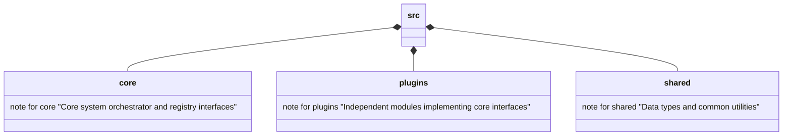

# Microkernel Architecture - Folder Structure
## Absolute isolation of the Core engine from volatile Plugins

```mermaid
classDiagram
    class src {
    }
    class core {
        note for core "Core system orchestrator and registry interfaces"
    }
    class plugins {
        note for plugins "Independent modules implementing core interfaces"
    }
    class shared {
        note for shared "Data types and common utilities"
    }
    src *-- core
    src *-- plugins
    src *-- shared
    class src:::default
    class core:::component
    class plugins:::component
    class shared:::component
```
