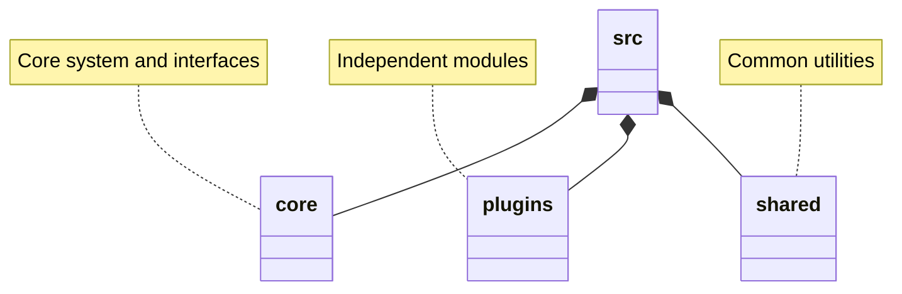

# Folder Structure

```mermaid
classDiagram
    class src
    class core
    class plugins
    class shared

    src *-- core
    src *-- plugins
    src *-- shared

    note for core "Core system and interfaces"
    note for plugins "Independent modules"
    note for shared "Common utilities"

    class src:::default
    class core:::component
    class plugins:::component
    class shared:::component
```
