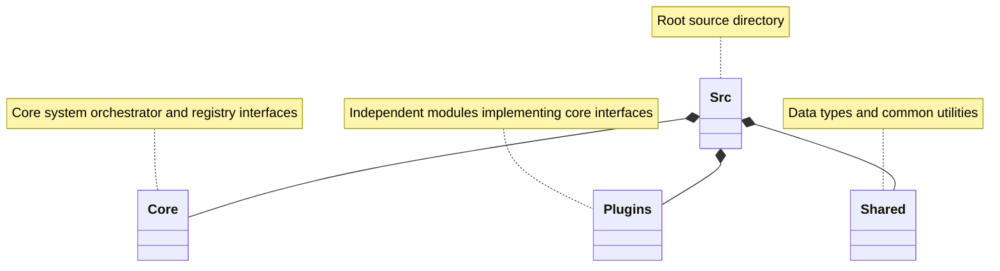

# Microkernel Architecture - Folder Structure

## Isolation of Core from Plugins

```mermaid
classDiagram
    note for Src "Root source directory"
    note for Core "Core system orchestrator and registry interfaces"
    note for Plugins "Independent modules implementing core interfaces"
    note for Shared "Data types and common utilities"

    class Src:::component
    class Core:::component
    class Plugins:::component
    class Shared:::component

    Src *-- Core
    Src *-- Plugins
    Src *-- Shared
```