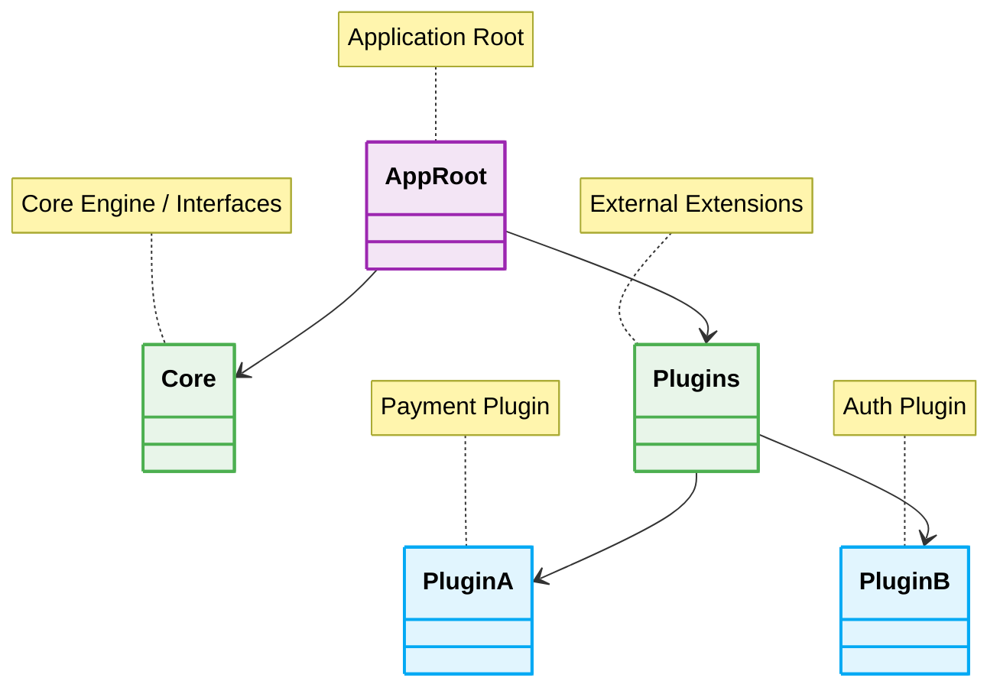

  # 🧩 Microkernel Architecture - Folder Structure

---

## ❌ Bad Practice
Mixing core system code with plugin implementations in the same directory.

## ⚠️ Problem
Lack of physical separation inevitably leads to logical coupling, where the core accidentally imports specific plugin details or dependencies.

## ✅ Best Practice
Strict separation using package boundaries or directories.

## 🚀 Solution
A strict structural divide guarantees that plugins can be added, removed, or developed in complete isolation, often as independent packages, enabling scalable, risk-free extensibility.
