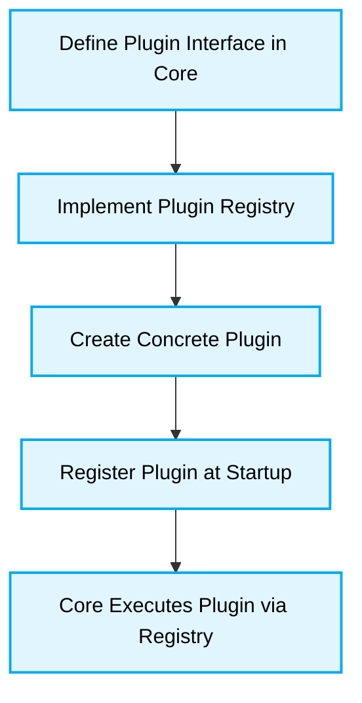

# 🛠️ Microkernel Architecture Implementation Guide

## 🗺️ Map of Patterns (Microkernel Modules)
- 🏠 **[Back to Microkernel Architecture Guidelines](./readme.md)**



## 1. Plugin Lifecycle and Error Handling

### ❌ Bad Practice
```typescript
// Inside the core engine
activePlugins.forEach(plugin => {
    // If one plugin throws an error, the entire core crashes
    plugin.execute(data);
});
```

### ⚠️ Problem
Plugins are volatile by nature (often connecting to external APIs). Allowing an unhandled exception in a plugin to crash the Core Engine violates the resilience of the architecture.

### ✅ Best Practice
> [!NOTE]
> **Internal Routing:** For more context, refer back to the [Microkernel Architecture Guidelines](./readme.md).

```typescript
class CoreEngine {
  async runPlugins(data: unknown) {
    const results = [];
    for (const plugin of this.registry.getPlugins()) {
      try {
        // Isolate plugin execution
        const result = await plugin.execute(data);
        results.push({ status: 'success', result });
      } catch (error) {
        // Deterministic error boundary
        console.error(`Plugin ${plugin.name} failed:`, error);
        results.push({ status: 'error', error: error.message });
        // Core continues executing other plugins safely
      }
    }
    return results;
  }
}
```

### 🚀 Solution
Implementing strict Error Boundaries around plugin execution guarantees that the Microkernel remains stable regardless of plugin quality. This deterministic execution pattern is critical for AI Agents generating plugins, ensuring their code cannot inadvertently destroy the main application loop.
