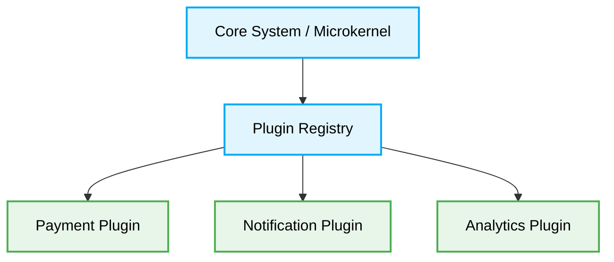

# 🧩 Microkernel Architecture (Plugin Architecture) Production-Ready Best Practices

[🏠 На главную](../README.md)

# Context & Scope
- **Primary Goal:** Document and strictly enforce best practices for Microkernel (Plugin) Architecture to ensure deterministic system extensibility.
- **Target Tooling:** AI Agents and Human Developers.
- **Tech Stack Version:** Agnostic

<div align="center">
  

  **Deterministic blueprints for extensible, core-driven applications.**
</div>

---
## 🗺️ Map of Patterns (Microkernel Modules)

This architecture defines strict boundaries between a minimal core system and extended functionalities implemented as standalone plugins. It guarantees O(1) impact on the core when adding or modifying auxiliary features.

- 🌊 **Data Flow:** Core-to-Plugin execution paths and contract enforcement.
- 📁 **Folder Structure:** Absolute isolation of the Core engine from volatile Plugins.
- ⚖️ **Trade-offs:** Extensibility vs. Contract Management complexity.
- 🛠️ **Implementation Guide:** Rules for defining strict interface boundaries and registry mechanisms.



## 🚀 The Core Philosophy

Microkernel Architecture strictly isolates essential business rules (the Core) from volatile, domain-specific, or external-facing logic (the Plugins). The Core MUST NOT depend on any plugin implementation. This resolves monolithic coupling and ensures new features are injected at runtime deterministically.

> [!IMPORTANT]
> **AI Constraint:** Agents MUST NOT mutate the Core module to add new functionality. They MUST define a new isolated Plugin module that implements the Core's strict interface and register it during initialization.

---

## 1. Core-Plugin Boundary Enforcement

### ❌ Bad Practice
```typescript
class MonolithicOrderProcessor {
  process(order: Order) {
    // Core logic
    this.validateOrder(order);
    this.updateInventory(order);

    // Hardcoded plugin logic polluting the core
    if (order.paymentMethod === 'stripe') {
        StripeAPI.charge(order.amount);
    } else if (order.paymentMethod === 'paypal') {
        PayPalAPI.transfer(order.amount);
    }

    if (order.wantsEmail) {
        EmailService.send(order.customerEmail);
    }
  }
}
```

### ⚠️ Problem
Hardcoding domain-specific or external integrations directly into the core processor creates a rigid dependency tree. Every new payment method or notification system requires modifying the core, violating the Open/Closed Principle. This leads to frequent merge conflicts, elevated regression risks, and unpredictable AI Agent modifications that break foundational system logic.

### ✅ Best Practice

> [!NOTE]
> **Internal Routing:** For more context, refer back to the [Architecture Map](../readme.md).

```typescript
// 1. Core strictly defines the Contract
interface PaymentPlugin {
  supports(method: string): boolean;
  processPayment(amount: number): Promise<void>;
}

// 2. Core acts only as the Orchestrator
class OrderProcessorCore {
  private paymentPlugins: PaymentPlugin[] = [];

  registerPaymentPlugin(plugin: PaymentPlugin) {
    this.paymentPlugins.push(plugin);
  }

  async process(order: Order) {
    this.validateOrder(order);
    this.updateInventory(order);

    const plugin = this.paymentPlugins.find(p => p.supports(order.paymentMethod));
    if (!plugin) {
        throw new Error(`Deterministic Error: No plugin found for ${order.paymentMethod}`);
    }

    await plugin.processPayment(order.amount);
  }
}

// 3. Plugins are completely isolated
class StripePlugin implements PaymentPlugin {
  supports(method: string): boolean {
    return method === 'stripe';
  }
  async processPayment(amount: number): Promise<void> {
    await StripeAPI.charge(amount);
  }
}
```

### 🚀 Solution
Defining strict interfaces (`PaymentPlugin`) and using a registration mechanism isolates the Core from external volatility. Implementing this plugin registry guarantees that the core system remains closed for modification but open for extension. This prevents feature creep from destabilizing the core and provides a resilient, predictable sandbox for deterministic AI code generation.
