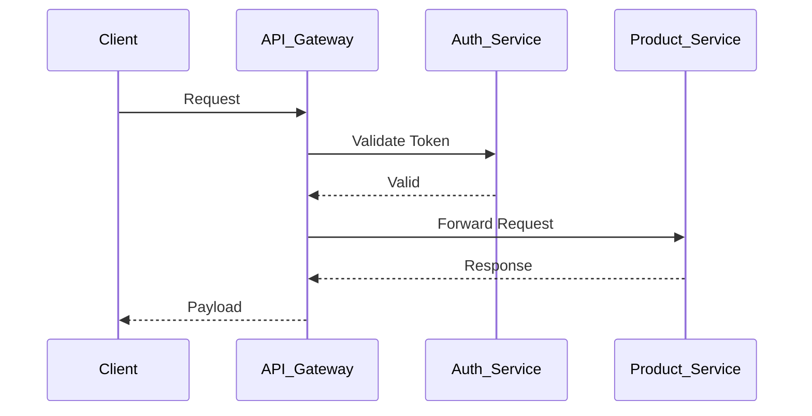

# Microservices - Data Flow

## Request and Event Lifecycle

```mermaid
sequenceDiagram
    participant Client
    participant API_Gateway
    participant Auth_Service
    participant Product_Service

    Client->>API_Gateway: Request
    API_Gateway->>Auth_Service: Validate Token
    Auth_Service-->>API_Gateway: Valid
    API_Gateway->>Product_Service: Forward Request
    Product_Service-->>API_Gateway: Response
    API_Gateway-->>Client: Payload
```

### Constraints
- Services must be independently deployable.
