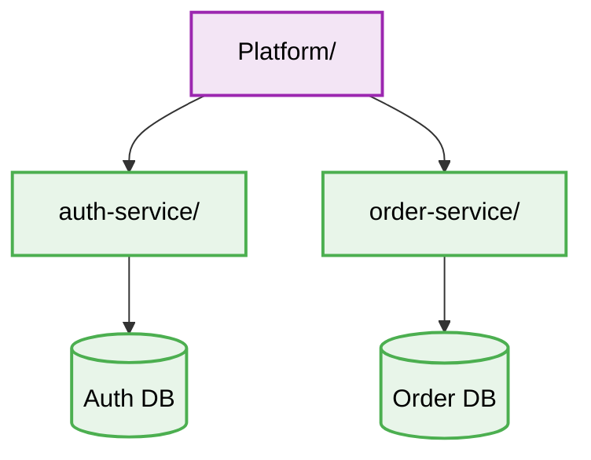

# Microservices - Folder Structure

## Layering logic

```mermaid
graph TD
    System[Platform/] --> Svc1[auth-service/]
    System --> Svc2[order-service/]
    Svc1 --> Svc1DB[(Auth DB)]
    Svc2 --> Svc2DB[(Order DB)]
    classDef default fill:#e1f5fe,stroke:#03a9f4,stroke-width:2px,color:#000;
    classDef component fill:#e8f5e9,stroke:#4caf50,stroke-width:2px,color:#000;
    classDef layout fill:#f3e5f5,stroke:#9c27b0,stroke-width:2px,color:#000;

    class System layout;
    class Svc1 component;
    class Svc2 component;
    class Svc1DB component;
    class Svc2DB component;
```

### Constraints
- Each service owns its database.
