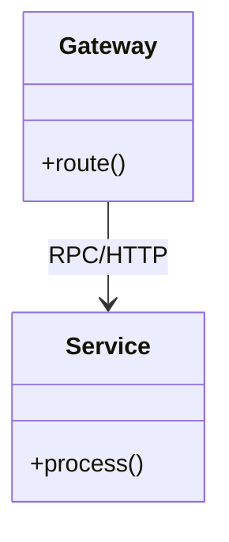

# Microservices - Implementation Guide

## Code patterns and Anti-patterns

### Entity Relationships

```mermaid
classDiagram
    class Gateway {
        +route()
    }
    class Service {
        +process()
    }
    Gateway --> Service : RPC/HTTP
```

### Rules
- Avoid synchronous cascading calls between services.
