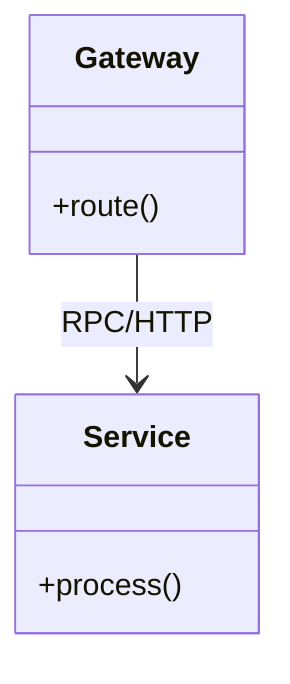

---

tags: [architecture, implementation, microservices, best-practices]
technology: Microservices
domain: Architecture
level: Senior/Architect
version: Agnostic
ai_role: Senior Architect
last_updated: 2026-03-29
---

# Microservices - Implementation Guide
## Code patterns and Anti-patterns

### Entity Relationships



## 1. Synchronous Cascading Calls

### ❌ Bad Practice
```typescript
// Synchronous calls block the entire chain
async function processOrder() {
    await inventoryService.reserve();
    await paymentService.charge();
    await notificationService.sendEmail();
}
```

### ⚠️ Problem
Avoid synchronous cascading calls between services. When `processOrder` calls `inventory`, `payment`, and `notification` synchronously over HTTP/RPC, it creates tight coupling and fragility. If `notificationService` fails or is slow, the entire order process fails or hangs, tying up resources.

### ✅ Best Practice
```typescript
// Asynchronous event-driven communication
async function processOrder() {
    await inventoryService.reserve();
    await paymentService.charge();

    // Publish an event instead of making a direct synchronous call
    await messageBroker.publish('OrderPaid', { orderId: 123 });
}
```

### 🚀 Solution
Use Event-Driven Architecture for cross-service communication when immediate consistency is not strictly required. By publishing an `OrderPaid` event, the `notificationService` can react to it asynchronously. This decouples the services, improves fault tolerance, and reduces the latency of the initial `processOrder` request.
