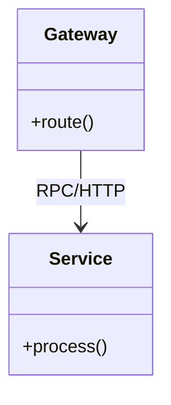

---
description: Vibe coding guidelines and architectural constraints for Vibe Coding within the Architecture domain.
tags: [vibe-coding, architecture, best-practices, architecture]
topic: Vibe Coding
complexity: Architect
last_evolution: 2026-03-29
vibe_coding_ready: true
technology: Vibe Coding
domain: Architecture
level: Senior/Architect
version: Latest
ai_role: Senior Vibe Coding Expert
last_updated: 2026-03-29---# Microservices - Implementation Guide
## Code patterns and Anti-patterns

### Entity Relationships

### Rules
- Avoid synchronous cascading calls between services.
