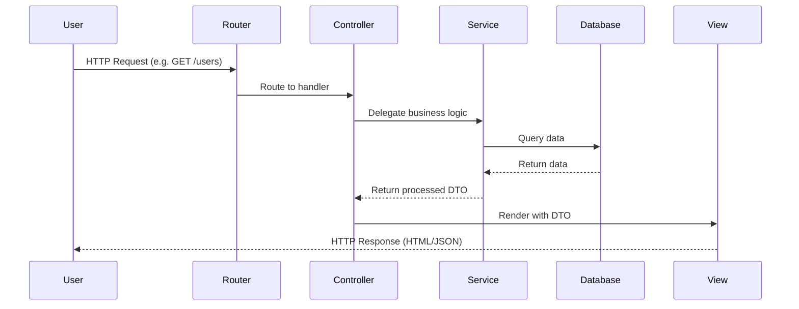

# Model-View-Controller (MVC) - Data Flow

## Request and Event Lifecycle

### Constraints
- Unidirectional request flow: User -> Controller -> Service -> DB -> View -> User.
- Controller orchestrates, it does not contain business logic.
- View is pure presentation and rendering.
