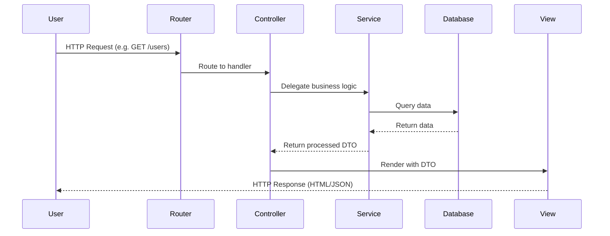

---
description: Vibe coding guidelines and architectural constraints for MVC within the Architecture domain.
tags: [mvc, architecture, best-practices, architecture]
topic: MVC
complexity: Architect
last_evolution: 2026-03-29
vibe_coding_ready: true
technology: MVC
domain: Architecture
level: Senior/Architect
version: Latest
ai_role: Senior MVC Expert
last_updated: 2026-03-29---# Model-View-Controller (MVC) - Data Flow
## Request and Event Lifecycle

```mermaid
sequenceDiagram
    participant User
    participant Router as Router
    participant Controller as Controller
    participant Service as Service
    participant Database as Database
    participant View as View

    User->>Router: HTTP Request (e.g. GET /users)
    Router->>Controller: Route to handler
    Controller->>Service: Delegate business logic
    Service->>Database: Query data
    Database-->>Service: Return data
    Service-->>Controller: Return processed DTO
    Controller->>View: Render with DTO
    View-->>User: HTTP Response (HTML/JSON)
```

### Constraints
- Unidirectional request flow: User -> Controller -> Service -> DB -> View -> User.
- Controller orchestrates, it does not contain business logic.
- View is pure presentation and rendering.
