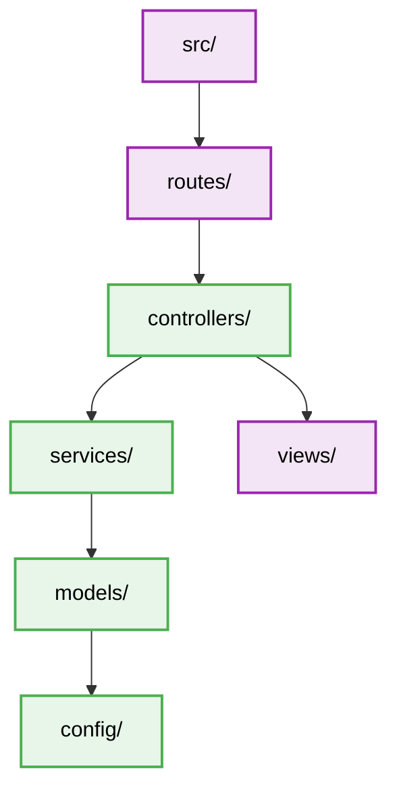

# Model-View-Controller (MVC) - Folder Structure

## Layering publisher/subscriber logic

### Constraints
- **controllers**: Orchestrate requests and responses. Thin layer.
- **services**: Heavy lifting, core business rules, and use case implementations.
- **models**: Data persistence definitions, ORM mapping.
- **views**: Presentation layer (e.g. Handlebars, EJS, React components).
- **routes**: API endpoints definition, mapping URLs to controllers.
