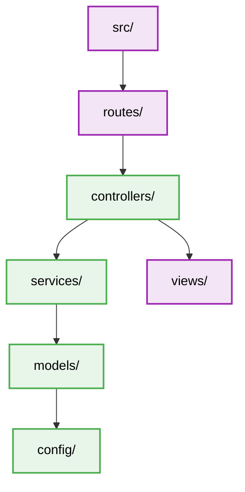

---
description: Vibe coding guidelines and architectural constraints for MVC within the Architecture domain.
tags: [mvc, architecture, best-practices, architecture]
topic: MVC
complexity: Architect
last_evolution: 2026-03-29
vibe_coding_ready: true
technology: MVC
domain: Architecture
level: Senior/Architect
version: Latest
ai_role: Senior MVC Expert
last_updated: 2026-03-29---# Model-View-Controller (MVC) - Folder Structure
## Layering publisher/subscriber logic

```mermaid
graph TD
    App[src/] --> Routes[routes/]
    Routes --> Controllers[controllers/]
    Controllers --> Services[services/]
    Services --> Models[models/]
    Models --> Config[config/]
    Controllers --> Views[views/]
    classDef default fill:#e1f5fe,stroke:#03a9f4,stroke-width:2px,color:#000;
    classDef component fill:#e8f5e9,stroke:#4caf50,stroke-width:2px,color:#000;
    classDef layout fill:#f3e5f5,stroke:#9c27b0,stroke-width:2px,color:#000;

    class Models component;
    class Services component;
    class Controllers component;
    class Routes layout;
    class Views layout;
    class Config component;
    class App layout;
```

### Constraints
- **controllers**: Orchestrate requests and responses. Thin layer.
- **services**: Heavy lifting, core business rules, and use case implementations.
- **models**: Data persistence definitions, ORM mapping.
- **views**: Presentation layer (e.g. Handlebars, EJS, React components).
- **routes**: API endpoints definition, mapping URLs to controllers.
