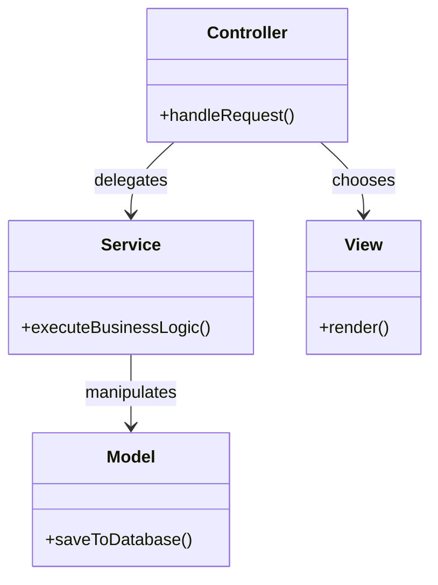

# Model-View-Controller (MVC) - Implementation Guide

## Code patterns and Anti-patterns

### Entity Relationships

### Rules for implementation:
1. **Thin Controllers**: Move all business logic into Service classes.
2. **DTOs**: Pass Data Transfer Objects between layers to avoid leaking DB schemas.
3. **Dependency Injection**: Use DI to pass services into controllers for better testability.

### Anti-patterns:
- **Fat Controllers**: Containing raw SQL, business logic, or file system access.
- **Logic in Views**: Conditional statements that reflect business rules in the UI layer.
- **Database Logic in Controllers**: Controllers directly calling `ORM.find()` or similar.
