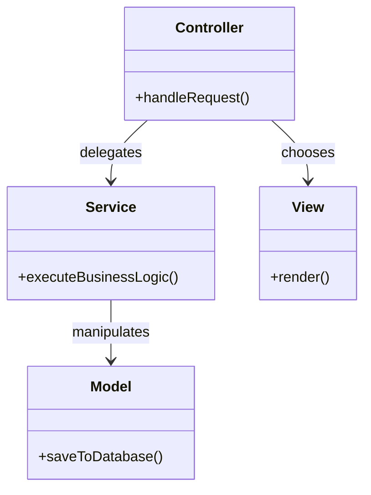

---
description: Vibe coding guidelines and architectural constraints for MVC within the Architecture domain.
tags: [mvc, architecture, best-practices, architecture]
topic: MVC
complexity: Architect
last_evolution: 2026-03-29
vibe_coding_ready: true
technology: MVC
domain: Architecture
level: Senior/Architect
version: Latest
ai_role: Senior MVC Expert
last_updated: 2026-03-29---# Model-View-Controller (MVC) - Implementation Guide
## Code patterns and Anti-patterns

### Entity Relationships

```mermaid
classDiagram
    class Controller {
        +handleRequest()
    }
    class Service {
        +executeBusinessLogic()
    }
    class Model {
        +saveToDatabase()
    }
    class View {
        +render()
    }
    Controller --> Service : delegates
    Controller --> View : chooses
    Service --> Model : manipulates
```

### Rules for implementation:
1. **Thin Controllers**: Move all business logic into Service classes.
2. **DTOs**: Pass Data Transfer Objects between layers to avoid leaking DB schemas.
3. **Dependency Injection**: Use DI to pass services into controllers for better testability.

### Anti-patterns:
- **Fat Controllers**: Containing raw SQL, business logic, or file system access.
- **Logic in Views**: Conditional statements that reflect business rules in the UI layer.
- **Database Logic in Controllers**: Controllers directly calling `ORM.find()` or similar.
