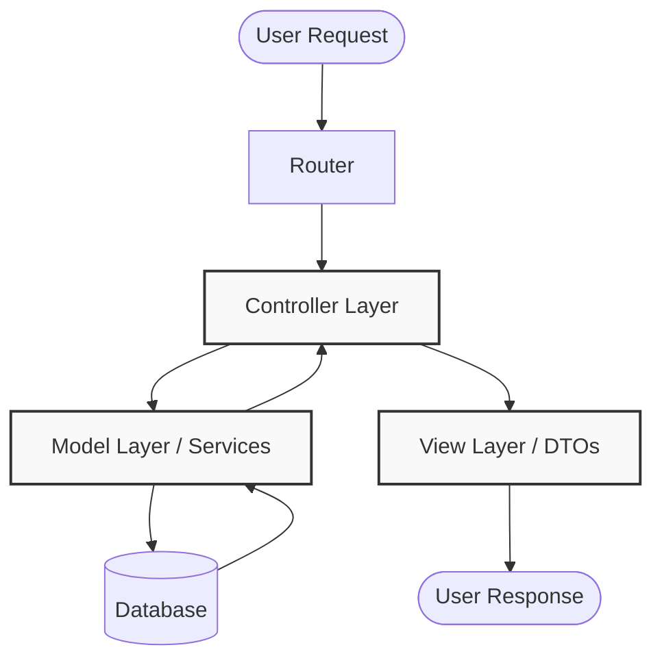

<div align="center">
  # 🏛️ Model-View-Controller (MVC) Production-Ready Best Practices
</div>

---

Этот инженерный директив определяет **лучшие практики (best practices)** для архитектуры MVC. Данный документ спроектирован для обеспечения максимальной масштабируемости, безопасности и качества кода при разработке приложений корпоративного уровня.

# Context & Scope
- **Primary Goal:** Предоставить строгие архитектурные правила и 20 практических паттернов для создания масштабируемых и детерминированных MVC-приложений.
- **Target Tooling:** AI-агенты (Cursor, Windsurf, Copilot, Antigravity) и Senior-разработчики.
- **Tech Stack Version:** Agnostic (Применимо к Node.js, NestJS, Express, Spring Boot, Django, ASP.NET и др.).

> [!IMPORTANT]
> **Архитектурный стандарт (Contract):** Контроллер принимает HTTP-запрос и маршрутизирует команды, Сервисы (или Доменная Модель) содержат бизнес-логику, Представление (View) отвечает исключительно за рендеринг абстрактных Data Transfer Objects (DTO).

## Architecture Flow (Mental Model)



---

## 1. Fat Controllers (God Object Controller)

### ❌ Bad Practice
```typescript
class UserController {
  async createUser(req, res) {
    // Controller explicitly handles business workflows
    const userExists = await db.query('SELECT * FROM users WHERE email = ?', [req.body.email]);
    if (userExists) return res.status(400).send('User exists');
    
    const hashedPassword = await bcrypt.hash(req.body.password, 10);
    const user = await db.query('INSERT INTO users...', [req.body.email, hashedPassword]);
    
    // Direct infra operation in controller
    await mailer.send(req.body.email, 'Welcome!');
    
    return res.status(201).json(user);
  }
}
```

### ⚠️ Problem
Контроллер перегружен низкоуровневыми деталями реализации (SQL, хеширование, работа почты). Это грубо нарушает принцип единственной ответственности (SRP) и делает код монолитным и нетестируемым.

### ✅ Best Practice
```typescript
class UserController {
  constructor(private userService: UserService) {}

  async createUser(req, res) {
    // Controller purely orchestrates the flow
    const user = await this.userService.register(req.body.email, req.body.password);
    return res.status(201).json(user);
  }
}
```

### 🚀 Solution
Придерживайтесь парадигмы «Тонкие контроллеры» (Thin Controllers). Делегируйте все бизнес-сценарии в выделенный сервисный слой (Service Layer) или агрегатные доменные модели.

---

## 2. Anemic Domain Model (Анемичная модель)

### ❌ Bad Practice
```typescript
// Model acts blindly as a raw data bag
class Order {
  id: string;
  total: number;
  status: string;
}

// Service mutates internal properties unrestrictedly
class OrderService {
  completeOrder(order: Order) {
    order.status = 'COMPLETED'; // Direct state manipulation
  }
}
```

### ⚠️ Problem
Доменные модели лишены поведения, а бизнес-логика процедурно размыта по сервисным функциям. Подобный антипаттерн ведет к дублированию валидации состояний.

### ✅ Best Practice
```typescript
// Rich Domain Model encapsulating invariant state rules
class Order {
  private status: 'PENDING' | 'COMPLETED';

  complete() {
    if (this.status === 'COMPLETED') throw new DomainException('Order already completed');
    this.status = 'COMPLETED';
  }
}
```

### 🚀 Solution
Инкапсулируйте изменение внутреннего состояния (мутации) внутри самой Модели (Rich Model). Сторонние сервисы обязаны вызывать методы-действия модели через подготовленные контракты, а не переопределять её данные.

---

## 3. Direct Model Exposure to View (Утечка схемы базы данных)

### ❌ Bad Practice
```typescript
class UserController {
  async getUser(req, res) {
    const user = await this.userService.findById(req.params.id);
    // Returning raw ORM model including sensitive metadata (passwordHash, dbIds)
    return res.json(user);
  }
}
```

### ⚠️ Problem
Абсолютная утечка конфиденциальных данных и жесткая привязка структуры ответов API к организации колонок в базе данных.

### ✅ Best Practice
```typescript
class UserController {
  async getUser(req, res) {
    const user = await this.userService.findById(req.params.id);
    // Transforming the internal state into an external schema
    return res.json(new UserResponseDTO(user));
  }
}
```

### 🚀 Solution
Архитектурно необходимо применять классы DTO (Data Transfer Objects) или ViewModels для изолированной трансформации доменной модели в структуру, безопасную для клиента (View / API).

---

## 4. Complex Logic within Views (Шаблонизация бизнес-правил)

### ❌ Bad Practice
```html
<!-- HTML View acts as a domain parser -->
<div>
  {{ if user.role == 'ADMIN' && user.subscription.daysLeft > 0 && user.isActive }}
    <button>Admin Panel</button>
  {{ /if }}
</div>
```

### ⚠️ Problem
Слой View заражается бизнес-вычислениями (вычисление прав доступа). Это делает фронтенд-логику сверххрупкой.

### ✅ Best Practice
```html
<!-- Primitive boolean check consumed from ViewModel -->
<div>
  {{ if viewModel.canAccessAdminPanel }}
    <button>Admin Panel</button>
  {{ /if }}
</div>
```

### 🚀 Solution
Экспортируйте агрегированные состояния для представления (View) в слое Презентера (ViewModel). View обязан оставаться «Глупым» (Dumb View), способным лишь на рендеринг булевых флагов и массивов из DTO.

---

## 5. View Layer Initiating Database Transactions

### ❌ Bad Practice
```typescript
// Logic embedded seamlessly inside a server-side template
const users = await db.query('SELECT * FROM users');
renderList(users);
```

### ⚠️ Problem
Представление (View) совершает обход Контроллера и уходит на прямую связь с уровнем Persistance. Разрушается изоляция и контроль транзакций MVC.

### ✅ Best Practice
```typescript
// Controller gathers context and constructs the rendering pipeline
class UserController {
  async index(req, res) {
    const users = await this.userService.getAll();
    res.render('users/index', { users });
  }
}
```

### 🚀 Solution
Вектор зависимости слоя View строго однонаправлен «Сверху вниз» на данные, инжектированные Контроллером. Представление не должно осознавать факт существования Хранилищ (Repositories/DBs).

---

## 6. Global State and Singletons Bound to Models

### ❌ Bad Practice
```typescript
class Invoice {
  generate() {
    // Hidden ambient dependency disrupting testability
    const taxRate = GlobalConfig.getInstance().get('TAX_RATE');
    return this.amount * taxRate;
  }
}
```

### ⚠️ Problem
Скрытые глобальные зависимости превращают Domain-модели в объекты, которые категорически невозможно покрыть Isolated Unit-тестами.

### ✅ Best Practice
```typescript
class Invoice {
  generate(taxRate: number) {
    // Deterministic parameter injection
    return this.amount * taxRate;
  }
}
```

### 🚀 Solution
Исключите использование глобальных Синглтонов в доменной зоне. Все внешние параметры или конфигурационное окружение передаются в модели прозрачно (explicit dependencies) через конструкторы или аргументы методов.

---

## 7. Mixing Low-Level Routing with Controller Logic

### ❌ Bad Practice
```typescript
// Controller morphs into a manual HTTP Parser
class RouterController {
  handleRequest(req, res) {
    if (req.url === '/users' && req.method === 'POST') {
      // Create user
    } else if (req.url === '/settings') {
       // Render settings
    }
  }
}
```

### ⚠️ Problem
Синтаксический разбор HTTP-заголовков, URI и бизнес-вызов смешаны в одном файле.

### ✅ Best Practice
```typescript
// Framework native routing abstracts URI path parsing away
router.post('/users', userController.create);
router.get('/settings', userController.showSettings);
```

### 🚀 Solution
Оставьте маршутизацию (Routing) фреймворку или выделенному слою Router. Задача Контроллера — реагировать на уже сформированный вызов метода с готовым payload.

---

## 8. Validation Rules Leaking into the Domain Layers

### ❌ Bad Practice
```typescript
class UserService {
  createUser(payload) {
    // Service validates raw HTTP format syntax
    if (typeof payload.email !== 'string' || !payload.email.includes('@')) {
      throw new Error('Invalid syntax format');
    }
  }
}
```

### ⚠️ Problem
Слой бизнес-логики загрязняется валидацией формата HTTP, что является прерогативой инфраструктурного Контроллера (Middleware / Validators).

### ✅ Best Practice
```typescript
class UserController {
  // Validation triggered inherently via decorators and decorators upstream
  async create(req: ValidatedRequest<CreateUserDTO>, res) {
    const user = await this.userService.createUser(req.body);
    return res.status(201).json(user);
  }
}
```

### 🚀 Solution
Валидация синтаксиса и форматов (JSON Schema, DTO Validation) обязана выполняться на слое обработки запросов (Gateways / Controllers). В Сервисы должны поступать исключительно детерминированные форматы данных.

---

## 9. Lack of Dependency Injection in Controllers

### ❌ Bad Practice
```typescript
class OrderController {
  constructor() {
    // Hard dependency binding
    this.orderService = new OrderService();
  }
}
```

### ⚠️ Problem
Абсолютно жесткое связывание (Tight Coupling). Невозможно замокать (Mock) `OrderService` при тестировании `OrderController`.

### ✅ Best Practice
```typescript
class OrderController {
  // Dependency Injection driven by Container
  constructor(private readonly orderService: IOrderService) {}
}
```

### 🚀 Solution
Утилизируйте паттерн Dependency Injection (DI). Контроллеры запрашивают нужные сервисы или репозитории через интерфейсы (IoC Containers), что гарантирует возможность горячей подмены абстракций.

---

## 10. Generating Raw HTML Strings Inside Controllers

### ❌ Bad Practice
```typescript
class WelcomeController {
  index(req, res) {
    // Controller mimics the View layer responsibilities
    return res.send('<main><h1>Welcome to our App!</h1></main>');
  }
}
```

### ⚠️ Problem
Уничтожение слоя Представления (View). Кардинальные изменения в UI-дизайне потребуют вмешательства в скомпилированную бизнес-логику сервера.

### ✅ Best Practice
```typescript
class WelcomeController {
  index(req, res) {
    // Delegating rendering engine the responsibility to draw UI
    return res.render('welcome-screen', new WelcomeViewModel('Welcome'));
  }
}
```

### 🚀 Solution
Контроллер НИКОГДА не генерирует разметку напрямую. Его функциональная гарантия — передать структуру данных (ViewModel / JSON) стандартизированному движку шаблонизации (Handlebars, React Server, EJS).

---

## 11. God Models (Monolithic Bounded Contexts)

### ❌ Bad Practice
```typescript
// Single Object encompasses logically disconnected architectures
class StandardAppModel {
  saveUser() { ... }
  processCheckoutTransaction() { ... }
  generatePDFReport() { ... }
}
```

### ⚠️ Problem
Катастрофическое нарушение SRP и принципов чистого проектирования. Монолитная модель становится узким "бутылочным горлышком", генерируя тысячи конфликтов слияния (Merge Conflicts).

### ✅ Best Practice
```typescript
// Granular Domain Isolation
class UserEntity { ... }
class CheckoutSaga { ... }
class PdfGeneratorService { ... }
```

### 🚀 Solution
Декомпозируйте супер-модели на узконаправленные агрегаты (Aggregates) в рамках строгих контекстов предметной области (Bounded Contexts).

---

## 12. View Layer Mutating Upstream State

### ❌ Bad Practice
```typescript
// Interactive View mutates data source locally
<button onClick={() => UserModel.toggleStatus()} />
```

### ⚠️ Problem
Представление меняет состояние Модели, обходя контроллер и не уведомляя внешние системы (базы данных или серверное состояние).

### ✅ Best Practice
```typescript
// View emits command downstream towards Controller / Orchestrator
<form action="/users/status/toggle" method="POST">
    <button type="submit">Toggle</button>
</form>
```

### 🚀 Solution
Паттерн MVC предполагает, что View является лишь отражением (Read-only Projection) текущих данных. Для мутаций View должен отправить инструкцию для Контроллера (HTTP Request, Event), который санкционирует процесс.

---

## 13. Hardwired Environment Secrets within Logic Code

### ❌ Bad Practice
```typescript
class BillingService {
  execute() {
    // Vendor API Keys glued to codebase
    const secretApiKey = 'sk_live_abc123';
  }
}
```

### ⚠️ Problem
Критическая уязвимость базы кода (Data Leak). Привязка сервиса к единственному окружению (Невозможно тестировать на Stage серверах).

### ✅ Best Practice
```typescript
class BillingService {
  constructor(private configOpts: AppConfig) {}
  execute() {
    const secretApiKey = this.configOpts.StripeSecret;
  }
}
```

### 🚀 Solution
Запрещен хардкод любых параметров окружения (Passwords, URLs, Tokens) в Контроллерах и Моделях. Вся инфраструктура загружается из специализированного провайдера конфигураций.

---

## 14. Blocking Main Thread in Standard Controllers

### ❌ Bad Practice
```typescript
class ReportController {
  generate(req, res) {
    // Blocks Node.js Event Loop for 15 seconds
    const pdfBuffer = executeHeavySyncPDFGeneration(); 
    return res.download(pdfBuffer);
  }
}
```

### ⚠️ Problem
Синхронная процессорная блокировка вешает всё приложение. Пользователи на других маршрутах получат тайм-ауты (Timeouts).

### ✅ Best Practice
```typescript
class ReportController {
  async generate(req, res) {
    // Controller proxies the heavy lift to asynchronous background workers
    const reportRefId = await this.queueClient.submitPdfJob();
    return res.status(202).json({ trackId: reportRefId, status: 'PROCESSING' });
  }
}
```

### 🚀 Solution
Интегрируйте Job-системы (RabbitMQ, Redis Queues). Контроллер должен делегировать ресурсоемкие задачи воркеру в фоне и мгновенно возвращать HTTP 202 (Accepted).

---

## 15. The "Repository" Abstraction Leak to View/Controller

### ❌ Bad Practice
```typescript
class DashboardController {
  async view(req, res) {
    // Controller operates in database language directly
    const report = await db.rawQuery('SELECT SUM(revenue) FROM transactions');
    res.render('stats', { report });
  }
}
```

### ⚠️ Problem
Стирание абстракций СУБД. Контроллер осведомлен о диалекте SQL/GraphQL. При смене БД потребуется переписывать весь серверный роутинг.

### ✅ Best Practice
```typescript
class DashboardController {
  async view(req, res) {
    // Interfacing with agnostic Domain Repository layer
    const report = await this.revenueRepository.getSum();
    res.render('stats', { report });
  }
}
```

### 🚀 Solution
Ограждайте слой Представлений и Контроллеров от низкоуровневых операций I/O. Интегрируйте паттерны Repository / Data Access Object (DAO).

---

## 16. Exposing Sequent Database Identifiers (IDOR Threat)

### ❌ Bad Practice
```typescript
// Providing predictable physical IDs inside external responses
class TransactionResponse {
  id: number; // Values range like 1205, 1206, 1207
}
```

### ⚠️ Problem
Инъекция уязвимости Insecure Direct Object Reference (IDOR). Злоумышленник может энумерировать идентификаторы соседних сущностей в URL-запросах.

### ✅ Best Practice
```typescript
class TransactionResponse {
  id: string; // Values mapped to '7f9c2d14-3a21... ' (UUIDv4 Hash)
}
```

### 🚀 Solution
Транслируйте внутренние физические идентификаторы БД (Integers) во внешние строковые UUID или хэши прежде чем Контроллер перебросит их на View.

---

## 17. Duplicating Core Invariants Inside Templates

### ❌ Bad Practice
```typescript
// Model
class Package { isFragile() { return this.weight > 50; } }

// View (HTML)
{{ if package.weight > 50 }} <span>Fragile Tag</span> {{ /if }}
```

### ⚠️ Problem
Дублирование доменных инвариантов бизнес-системы. В случае изменения порога веса до 40 кг, программистам придется проводить ручной аудит всех фронтенд-шаблонов.

### ✅ Best Practice
```typescript
// View inherently relies on Domain evaluation
{{ if package.isFragile }} <span>Fragile Tag</span> {{ /if }}
```

### 🚀 Solution
Доменная Модель — единственный "Источник Правды" (Source of Truth). View должно читать готовое вычисленное полиморфное состояние, предоставленное системой.

---

## 18. Side-Effects Orchestration Inside Controller Scope

### ❌ Bad Practice
```typescript
class SubscriptionController {
  async charge(req, res) {
    await this.subscriptionService.pay();
    // High-level orchestration bloat
    await this.analytics.trackPurchase();
    await this.mailer.sendReceipt();
    await this.cache.purge('/subscription');
    return res.sendStatus(200);
  }
}
```

### ⚠️ Problem
Контроллер вытягивает на себя роль Бога-Оркестратора. Любые новые сайд-эффекты будут увеличивать его размер экспоненциально и замедлять HTTP-канал.

### ✅ Best Practice
```typescript
class SubscriptionController {
  async charge(req, res) {
    // Domain Events handle disconnected procedures automatically attached
    await this.subscriptionService.pay();
    return res.sendStatus(200);
  }
}
```

### 🚀 Solution
Внедряйте Domain Events Architectures (Pub/Sub брокеры). Контроллер отвечает сугубо за инициирование бизнес-события "Оплата совершена", логики рассылки не должны блокировать канал ответа клиенту.

---

## 19. Fractured Exception Logging (Try-Catch Hell)

### ❌ Bad Practice
```typescript
class ItemController {
  async show(req, res) {
    try {
      res.json(await db.fetch(req.params.id));
    } catch (err) {
      // Manual heterogeneous error routing scattered everywhere
      res.status(500).json({ error: 'Server crashed' });
    }
  }
}
```

### ⚠️ Problem
Возникновение тысяч бесполезных блоков `try/catch` по всей кодовой базе MVC. Клиентские приложения получают ошибки разного формата от разных эндоинтов.

### ✅ Best Practice
```typescript
class ItemController {
  // Gracefully handles exceptions implicitly relying on a Pipeline Filter
  async show(req, res) {
    res.json(await this.itemService.findOrFail(req.params.id));
  }
}
```

### 🚀 Solution
Абстрагируйте процедуру захвата ошибок (Error Handling) в Глобальные Фильтры Исключений (Global Exception Handlers) фреймворка, стандартизировав формат возврата HTTP 4XX / 5XX ошибок для View.

---

## 20. Overusing the Model Segment for Hardware Infrastructure (AWS, FS)

### ❌ Bad Practice
```typescript
class CompanyLogo {
  async update(fileStream) {
    // Domain model executes third-party infrastructure protocol directly
    const s3 = new AWSS3Platform();
    await s3.put({ stream: fileStream });
  }
}
```

### ⚠️ Problem
Модель влита в инфраструктуру S3 SDK. Эта интеграция обрезает "Чистоту Архитектуры" и лишает модуль портативности на другие площадки хостинга.

### ✅ Best Practice
```typescript
class CompanyLogo {
  // Domain Model operates strictly locally
  setRemoteURI(url: string) { this.assetUrl = url; }
}

class AssetUploaderService {
  constructor(private storage: IStorageProvider) {}
  async handleUpload(logo: CompanyLogo, file) {
    const url = await this.storage.upload(file);
    logo.setRemoteURI(url);
  }
}
```

### 🚀 Solution
Соблюдайте границу Ports and Adapters. Переносите интеграцию с аппаратным вводом (Файловые системы, AWS, Redis) на плечи внешних Infrastructure Services, оставляя MVC Модели концептуально абстрактными сущностями.

---

<br>

<div align="center">
  [В архитектуру FSD](../../architectures/feature-sliced-design/readme.md) <br><br>
  <b>Жестко соблюдайте границы паттерна Model-View-Controller для построения надежного, адаптивного программного обеспечения! 🏛️🚀</b>
</div>
