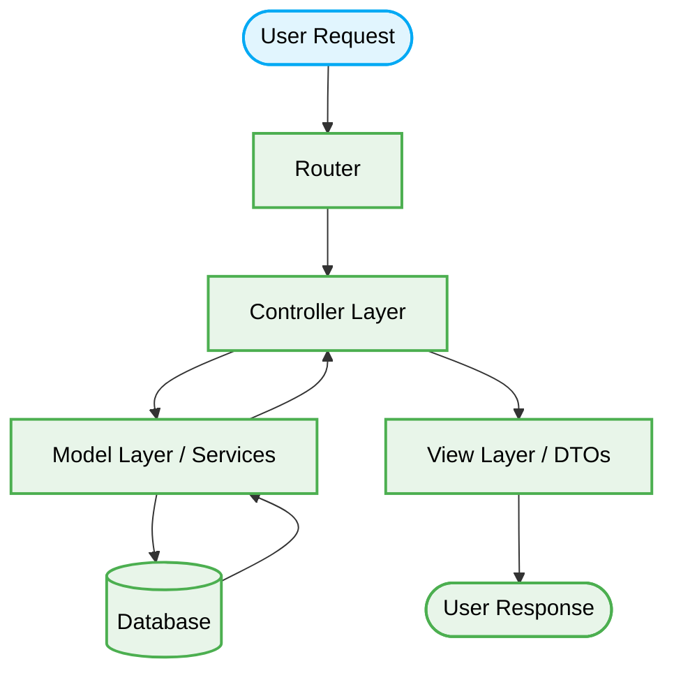

<div align="center">
  # 🏛️ Model-View-Controller (MVC) Production-Ready Best Practices
</div>
---

This engineering directive defines the **best practices** for the MVC architecture. This document is designed to ensure maximum scalability, security, and code quality when developing enterprise-level applications.
# Context & Scope
- **Primary Goal:** Provide strict architectural rules and 20 practical patterns for creating scalable and deterministic MVC applications.
- **Target Tooling:** AI Agents (Cursor, Windsurf, Copilot, Antigravity) and Senior Developers.
- **Tech Stack Version:** Agnostic (Applicable to Node.js, NestJS, Express, Spring Boot, Django, ASP.NET, etc.).

> [!IMPORTANT]
> **Architectural Contract:** The Controller receives the HTTP request and routes commands, Services (or Domain Model) contain the business logic, and the View is strictly responsible for rendering abstract Data Transfer Objects (DTOs).
## Architecture Flow (Mental Model)


```mermaid
graph TD
    User([User Request]) --> Router[Router]
    Router --> Controller[Controller Layer]
    
    Controller --> Model[Model Layer / Services]
    Model --> DB[(Database)]
    DB --> Model
    Model --> Controller
    
    Controller --> View[View Layer / DTOs]
    View --> Response([User Response])
    
    classDef infra fill:#f9f9f9,stroke:#333,stroke-width:2px;
    class Controller,Model,View infra;
    %% Added Design Token Styles for Mermaid Diagrams
    classDef default fill:#e1f5fe,stroke:#03a9f4,stroke-width:2px,color:#000;
    classDef component fill:#e8f5e9,stroke:#4caf50,stroke-width:2px,color:#000;
    classDef layout fill:#f3e5f5,stroke:#9c27b0,stroke-width:2px,color:#000;

    class DB component;
    class Controller component;
    class View component;
    class Response component;
    class Model component;
    class Router component;

```
---

## Map of Patterns
- 📊 [**Data Flow:** Request and Event Lifecycle](./data-flow.md)
- 📁 [**Folder Structure:** Layering logic](./folder-structure.md)
- ⚖️ [**Trade-offs:** Pros, Cons, and System Constraints](./trade-offs.md)
- 🛠️ [**Implementation Guide:** Code patterns and Anti-patterns](./implementation-guide.md)
## 1. Fat Controllers (God Object Controller)

### ❌ Bad Practice
```typescript
class UserController {
  async createUser(req, res) {
    // Controller explicitly handles business workflows
    const userExists = await db.query('SELECT * FROM users WHERE email = ?', [req.body.email]);
    if (userExists) return res.status(400).send('User exists');
    
    const hashedPassword = await bcrypt.hash(req.body.password, 10);
    const user = await db.query('INSERT INTO users...', [req.body.email, hashedPassword]);
    
    // Direct infra operation in controller
    await mailer.send(req.body.email, 'Welcome!');
    
    return res.status(201).json(user);
  }
}
```

### ⚠️ Problem
The Controller is overloaded with low-level implementation details (SQL, hashing, email processing). This grossly violates the Single Responsibility Principle (SRP) and makes the code monolithic and untestable.

### ✅ Best Practice
```typescript
class UserController {
  constructor(private userService: UserService) {}

  async createUser(req, res) {
    // Controller purely orchestrates the flow
    const user = await this.userService.register(req.body.email, req.body.password);
    return res.status(201).json(user);
  }
}
```

### 🚀 Solution
Adhere to the 'Thin Controllers' paradigm. Delegate all business scenarios to a dedicated Service Layer or aggregate domain models.
---
## 2. Anemic Domain Model

### ❌ Bad Practice
```typescript
// Model acts blindly as a raw data bag
class Order {
  id: string;
  total: number;
  status: string;
}

// Service mutates internal properties unrestrictedly
class OrderService {
  completeOrder(order: Order) {
    order.status = 'COMPLETED'; // Direct state manipulation
  }
}
```

### ⚠️ Problem
Domain models lack behavior, and business logic is procedurally scattered across service functions. This anti-pattern leads to duplicated state validation.

### ✅ Best Practice
```typescript
// Rich Domain Model encapsulating invariant state rules
class Order {
  private status: 'PENDING' | 'COMPLETED';

  complete() {
    if (this.status === 'COMPLETED') throw new DomainException('Order already completed');
    this.status = 'COMPLETED';
  }
}
```

### 🚀 Solution
Encapsulate internal state mutations within the Model itself (Rich Model). External services must invoke the model's action methods via established contracts rather than overriding its data directly.
---
## 3. Direct Model Exposure to View

### ❌ Bad Practice
```typescript
class UserController {
  async getUser(req, res) {
    const user = await this.userService.findById(req.params.id);
    // Returning raw ORM model including sensitive metadata (passwordHash, dbIds)
    return res.json(user);
  }
}
```

### ⚠️ Problem
Absolute leakage of sensitive data and tight coupling of the API response structure to the database column organization.

### ✅ Best Practice
```typescript
class UserController {
  async getUser(req, res) {
    const user = await this.userService.findById(req.params.id);
    // Transforming the internal state into an external schema
    return res.json(new UserResponseDTO(user));
  }
}
```

### 🚀 Solution
Architecturally, it is mandatory to use DTO (Data Transfer Object) or ViewModel classes to isolate the transformation of the domain model into a client-safe structure (View / API).
---
## 4. Complex Logic within Views

### ❌ Bad Practice
```html
<!-- HTML View acts as a domain parser -->
<div>
  {{ if user.role == 'ADMIN' && user.subscription.daysLeft > 0 && user.isActive }}
    <button>Admin Panel</button>
  {{ /if }}
</div>
```

### ⚠️ Problem
The View layer gets infected with business computations (calculating access rights). This makes the frontend logic extremely fragile.

### ✅ Best Practice
```html
<!-- Primitive boolean check consumed from ViewModel -->
<div>
  {{ if viewModel.canAccessAdminPanel }}
    <button>Admin Panel</button>
  {{ /if }}
</div>
```

### 🚀 Solution
Export aggregated states for the presentation layer (View) via a Presenter (ViewModel). The View must remain 'Dumb', capable only of rendering boolean flags and arrays of DTOs.
---
## 5. View Layer Initiating Database Transactions

### ❌ Bad Practice
```typescript
// Logic embedded seamlessly inside a server-side template
const users = await db.query('SELECT * FROM users');
renderList(users);
```

### ⚠️ Problem
The View bypasses the Controller and communicates directly with the Persistence layer. This breaks the isolation and transaction control of MVC.

### ✅ Best Practice
```typescript
// Controller gathers context and constructs the rendering pipeline
class UserController {
  async index(req, res) {
    const users = await this.userService.getAll();
    res.render('users/index', { users });
  }
}
```

### 🚀 Solution
The dependency vector of the View layer is strictly unidirectional 'Top-Down', relying on data injected by the Controller. The View must not be aware of the existence of any Storage (Repositories/DBs).
---
## 6. Global State and Singletons Bound to Models

### ❌ Bad Practice
```typescript
class Invoice {
  generate() {
    // Hidden ambient dependency disrupting testability
    const taxRate = GlobalConfig.getInstance().get('TAX_RATE');
    return this.amount * taxRate;
  }
}
```

### ⚠️ Problem
Hidden global dependencies turn Domain models into objects that are absolutely impossible to cover with Isolated Unit tests.

### ✅ Best Practice
```typescript
class Invoice {
  generate(taxRate: number) {
    // Deterministic parameter injection
    return this.amount * taxRate;
  }
}
```

### 🚀 Solution
Eliminate the use of global Singletons within the domain area. All external parameters or environment configurations must be passed to models transparently (explicit dependencies) via constructors or method arguments.
---
## 7. Mixing Low-Level Routing with Controller Logic

### ❌ Bad Practice
```typescript
// Controller morphs into a manual HTTP Parser
class RouterController {
  handleRequest(req, res) {
    if (req.url === '/users' && req.method === 'POST') {
      // Create user
    } else if (req.url === '/settings') {
       // Render settings
    }
  }
}
```

### ⚠️ Problem
Syntax parsing of HTTP headers, URIs, and the business call are mixed together in a single file.

### ✅ Best Practice
```typescript
// Framework native routing abstracts URI path parsing away
router.post('/users', userController.create);
router.get('/settings', userController.showSettings);
```

### 🚀 Solution
Leave routing to the framework or a dedicated Router layer. The Controller's job is to respond to an already formed method call with a prepared payload.
---
## 8. Validation Rules Leaking into the Domain Layers

### ❌ Bad Practice
```typescript
class UserService {
  createUser(payload) {
    // Service validates raw HTTP format syntax
    if (typeof payload.email !== 'string' || !payload.email.includes('@')) {
      throw new Error('Invalid syntax format');
    }
  }
}
```

### ⚠️ Problem
The business logic layer is polluted with HTTP format validation, which is the prerogative of the infrastructural Controller (Middleware / Validators).

### ✅ Best Practice
```typescript
class UserController {
  // Validation triggered inherently via decorators and decorators upstream
  async create(req: ValidatedRequest<CreateUserDTO>, res) {
    const user = await this.userService.createUser(req.body);
    return res.status(201).json(user);
  }
}
```

### 🚀 Solution
Syntax and format validation (JSON Schema, DTO Validation) must be performed at the request processing layer (Gateways / Controllers). Services must receive strictly deterministic data formats.
---
## 9. Lack of Dependency Injection in Controllers

### ❌ Bad Practice
```typescript
class OrderController {
  constructor() {
    // Hard dependency binding
    this.orderService = new OrderService();
  }
}
```

### ⚠️ Problem
Absolute tight coupling. It is impossible to mock the `OrderService` when testing the `OrderController`.

### ✅ Best Practice
```typescript
class OrderController {
  // Dependency Injection driven by Container
  constructor(private readonly orderService: IOrderService) {}
}
```

### 🚀 Solution
Utilize the Dependency Injection (DI) pattern. Controllers request required services or repositories via interfaces (IoC Containers), guaranteeing the ability to hot-swap abstractions.
---
## 10. Generating Raw HTML Strings Inside Controllers

### ❌ Bad Practice
```typescript
class WelcomeController {
  index(req, res) {
    // Controller mimics the View layer responsibilities
    return res.send('<main><h1>Welcome to our App!</h1></main>');
  }
}
```

### ⚠️ Problem
Destroying the View layer. Drastic changes in UI design will require modifying the compiled server business logic.

### ✅ Best Practice
```typescript
class WelcomeController {
  index(req, res) {
    // Delegating rendering engine the responsibility to draw UI
    return res.render('welcome-screen', new WelcomeViewModel('Welcome'));
  }
}
```

### 🚀 Solution
The Controller NEVER generates markup directly. Its functional contract is to pass data structures (ViewModel / JSON) to a standardized templating engine (Handlebars, React Server, EJS).
---
## 11. God Models (Monolithic Bounded Contexts)

### ❌ Bad Practice
```typescript
// Single Object encompasses logically disconnected architectures
class StandardAppModel {
  saveUser() { ... }
  processCheckoutTransaction() { ... }
  generatePDFReport() { ... }
}
```

### ⚠️ Problem
A catastrophic violation of SRP and deterministic design principles. The monolithic model becomes a major bottleneck, generating thousands of merge conflicts.

### ✅ Best Practice
```typescript
// Granular Domain Isolation
class UserEntity { ... }
class CheckoutSaga { ... }
class PdfGeneratorService { ... }
```

### 🚀 Solution
Decompose god models into focused aggregates within strict Bounded Contexts.
---
## 12. View Layer Mutating Upstream State

### ❌ Bad Practice
```typescript
// Interactive View mutates data source locally
<button onClick={() => UserModel.toggleStatus()} />
```

### ⚠️ Problem
The View mutates the Model's state, bypassing the Controller and failing to notify external systems (databases or server state).

### ✅ Best Practice
```typescript
// View emits command downstream towards Controller / Orchestrator
<form action="/users/status/toggle" method="POST">
    <button type="submit">Toggle</button>
</form>
```

### 🚀 Solution
The MVC pattern dictates that the View is merely a Read-only Projection of the current data. For mutations, the View must send an instruction to the Controller (HTTP Request, Event), which then authorizes the process.
---
## 13. Hardwired Environment Secrets within Logic Code

### ❌ Bad Practice
```typescript
class BillingService {
  execute() {
    // Vendor API Keys glued to codebase
    const secretApiKey = 'sk_live_abc123';
  }
}
```

### ⚠️ Problem
A critical codebase vulnerability (Data Leak). Coupling the service to a single environment (Impossible to test on Staging servers).

### ✅ Best Practice
```typescript
class BillingService {
  constructor(private configOpts: AppConfig) {}
  execute() {
    const secretApiKey = this.configOpts.StripeSecret;
  }
}
```

### 🚀 Solution
Hardcoding any environment variables (Passwords, URLs, Tokens) in Controllers and Models is forbidden. All infrastructure configuration must be loaded from a specialized configuration provider.
---
## 14. Blocking Main Thread in Standard Controllers

### ❌ Bad Practice
```typescript
class ReportController {
  generate(req, res) {
    // Blocks Node.js Event Loop for 15 seconds
    const pdfBuffer = executeHeavySyncPDFGeneration(); 
    return res.download(pdfBuffer);
  }
}
```

### ⚠️ Problem
A synchronous CPU block freezes the entire application. Users on other routes will experience Timeouts.

### ✅ Best Practice
```typescript
class ReportController {
  async generate(req, res) {
    // Controller proxies the heavy lift to asynchronous background workers
    const reportRefId = await this.queueClient.submitPdfJob();
    return res.status(202).json({ trackId: reportRefId, status: 'PROCESSING' });
  }
}
```

### 🚀 Solution
Integrate Job systems (RabbitMQ, Redis Queues). The Controller must delegate resource-intensive tasks to background workers and immediately return HTTP 202 (Accepted).
---
## 15. The "Repository" Abstraction Leak to View/Controller

### ❌ Bad Practice
```typescript
class DashboardController {
  async view(req, res) {
    // Controller operates in database language directly
    const report = await db.rawQuery('SELECT SUM(revenue) FROM transactions');
    res.render('stats', { report });
  }
}
```

### ⚠️ Problem
Erasing DBMS abstractions. The Controller is aware of the SQL/GraphQL dialect. Changing the database will require rewriting all server routing.

### ✅ Best Practice
```typescript
class DashboardController {
  async view(req, res) {
    // Interfacing with agnostic Domain Repository layer
    const report = await this.revenueRepository.getSum();
    res.render('stats', { report });
  }
}
```

### 🚀 Solution
Shield the View and Controller layers from low-level I/O operations. Integrate Repository / Data Access Object (DAO) patterns.
---
## 16. Exposing Sequent Database Identifiers (IDOR Threat)

### ❌ Bad Practice
```typescript
// Providing predictable physical IDs inside external responses
class TransactionResponse {
  id: number; // Values range like 1205, 1206, 1207
}
```

### ⚠️ Problem
> [!IMPORTANT]
> Injecting an Insecure Direct Object Reference (IDOR) vulnerability. An attacker MUST enumerate the identifiers of neighboring entities in URL requests.

### ✅ Best Practice
```typescript
class TransactionResponse {
  id: string; // Values mapped to '7f9c2d14-3a21... ' (UUIDv4 Hash)
}
```

### 🚀 Solution
Translate internal physical database identifiers (Integers) into external string UUIDs or hashes before the Controller passes them to the View.
---
## 17. Duplicating Core Invariants Inside Templates

### ❌ Bad Practice
```typescript
// Model
class Package { isFragile() { return this.weight > 50; } }

// View (HTML)
{{ if package.weight > 50 }} <span>Fragile Tag</span> {{ /if }}
```

### ⚠️ Problem
Duplicating business system domain invariants. If the weight threshold changes to 40 kg, programmers will have to manually audit all frontend templates.

### ✅ Best Practice
```typescript
// View inherently relies on Domain evaluation
{{ if package.isFragile }} <span>Fragile Tag</span> {{ /if }}
```

### 🚀 Solution
> [!IMPORTANT]
> The Domain Model is the single "Source of Truth". The View MUST read pre-computed polymorphic state provided by the system.
---
## 18. Side-Effects Orchestration Inside Controller Scope

### ❌ Bad Practice
```typescript
class SubscriptionController {
  async charge(req, res) {
    await this.subscriptionService.pay();
    // High-level orchestration bloat
    await this.analytics.trackPurchase();
    await this.mailer.sendReceipt();
    await this.cache.purge('/subscription');
    return res.sendStatus(200);
  }
}
```

### ⚠️ Problem
The Controller assumes the role of an Orchestrator God. Any new side-effects will increase its size exponentially and slow down the HTTP channel.

### ✅ Best Practice
```typescript
class SubscriptionController {
  async charge(req, res) {
    // Domain Events handle disconnected procedures automatically attached
    await this.subscriptionService.pay();
    return res.sendStatus(200);
  }
}
```

### 🚀 Solution
> [!IMPORTANT]
> Implement Domain Events Architectures (Pub/Sub brokers). The Controller is strictly responsible for initiating the "Payment complete" business event; dispatch logic MUST not block the response channel to the client.
---
## 19. Fractured Exception Logging (Try-Catch Hell)

### ❌ Bad Practice
```typescript
class ItemController {
  async show(req, res) {
    try {
      res.json(await db.fetch(req.params.id));
    } catch (err) {
      // Manual heterogeneous error routing scattered everywhere
      res.status(500).json({ error: 'Server crashed' });
    }
  }
}
```

### ⚠️ Problem
The proliferation of thousands of useless `try/catch` blocks throughout the MVC codebase. Client applications receive differently formatted errors from different endpoints.

### ✅ Best Practice
```typescript
class ItemController {
  // Gracefully handles exceptions implicitly relying on a Pipeline Filter
  async show(req, res) {
    res.json(await this.itemService.findOrFail(req.params.id));
  }
}
```

### 🚀 Solution
Abstract the Error Handling procedure into framework-level Global Exception Handlers, standardizing the format of HTTP 4XX / 5XX error responses for the View.
---
## 20. Overusing the Model Segment for Hardware Infrastructure (AWS, FS)

### ❌ Bad Practice
```typescript
class CompanyLogo {
  async update(fileStream) {
    // Domain model executes third-party infrastructure protocol directly
    const s3 = new AWSS3Platform();
    await s3.put({ stream: fileStream });
  }
}
```

### ⚠️ Problem
The Model is fused with the S3 SDK infrastructure. This integration breaks the "Clean Architecture" and strips the module of portability to other hosting platforms.

### ✅ Best Practice
```typescript
class CompanyLogo {
  // Domain Model operates strictly locally
  setRemoteURI(url: string) { this.assetUrl = url; }
}

class AssetUploaderService {
  constructor(private storage: IStorageProvider) {}
  async handleUpload(logo: CompanyLogo, file) {
    const url = await this.storage.upload(file);
    logo.setRemoteURI(url);
  }
}
```

### 🚀 Solution
Observe the boundaries of Ports and Adapters. Delegate integration with hardware input (File Systems, AWS, Redis) to external Infrastructure Services, keeping MVC Models conceptually abstract.
---

<br>

<div align="center">
  [Go to FSD Architecture](../../architectures/feature-sliced-design/readme.md) <br><br>
  <b>Strictly observe the boundaries of the Model-View-Controller pattern to build reliable, adaptive software! 🏛️🚀</b>
</div>
