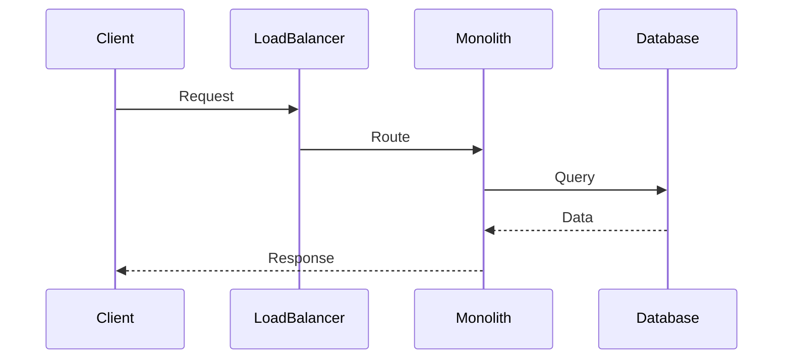

# Monolithic Architecture - Data Flow

## Request and Event Lifecycle

```mermaid
sequenceDiagram
    participant Client
    participant LoadBalancer
    participant Monolith
    participant Database

    Client->>LoadBalancer: Request
    LoadBalancer->>Monolith: Route
    Monolith->>Database: Query
    Database-->>Monolith: Data
    Monolith-->>Client: Response
```

### Constraints
- All bounded contexts run in the same process.
