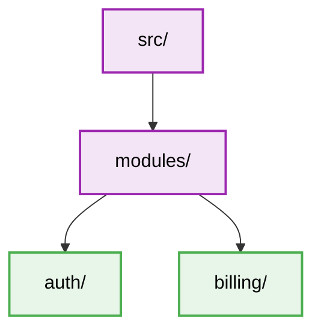

# Monolithic Architecture - Folder Structure

## Layering logic

```mermaid
graph TD
    App[src/] --> Modules[modules/]
    Modules --> Auth[auth/]
    Modules --> Billing[billing/]
    classDef default fill:#e1f5fe,stroke:#03a9f4,stroke-width:2px,color:#000;
    classDef component fill:#e8f5e9,stroke:#4caf50,stroke-width:2px,color:#000;
    classDef layout fill:#f3e5f5,stroke:#9c27b0,stroke-width:2px,color:#000;

    class App layout;
    class Modules layout;
    class Auth component;
    class Billing component;
```

### Constraints
- Strict modular boundaries to prevent spaghetti code.
