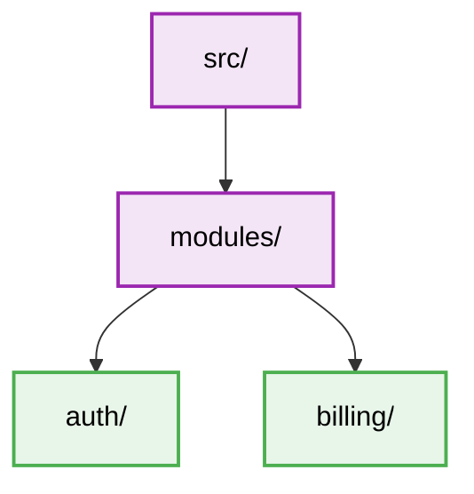

---
description: Vibe coding guidelines and architectural constraints for Monolithic Architecture within the Architecture domain.
tags: [monolithic-architecture, architecture, best-practices, architecture]
topic: Monolithic Architecture
complexity: Architect
last_evolution: 2026-03-29
vibe_coding_ready: true
technology: Monolithic Architecture
domain: Architecture
level: Senior/Architect
version: Latest
ai_role: Senior Monolithic Architecture Expert
last_updated: 2026-03-29---# Monolithic Architecture - Folder Structure
## Layering logic

### Constraints
- Strict modular boundaries to prevent spaghetti code.
