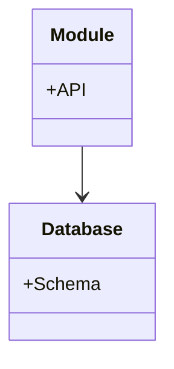

# Monolithic Architecture - Implementation Guide

## Code patterns and Anti-patterns

### Entity Relationships

```mermaid
classDiagram
    class Module {
        +API
    }
    class Database {
        +Schema
    }
    Module --> Database
```

### Rules
- Adopt Modular Monolith principles over time.
