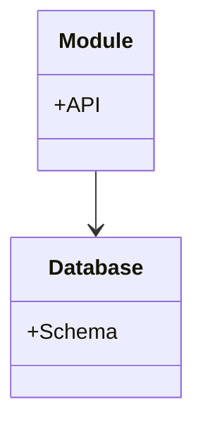

# Monolithic Architecture - Implementation Guide
## Code patterns and Anti-patterns

### Entity Relationships



### Rules
- Adopt Modular Monolith principles over time.

### 1. Tight Coupling via Global State

### ❌ Bad Practice
```typescript
// Global state shared across the entire monolith
const globalAppCache = new Map<string, any>();

class UserService {
  getUser(id: string) {
    if (globalAppCache.has(`user_${id}`)) {
      return globalAppCache.get(`user_${id}`);
    }
    // Fetch from DB...
  }
}

class OrderService {
  processOrder(order: any) {
    // Arbitrarily mutating global state used by other domains
    globalAppCache.set(`user_${order.userId}`, { lastOrder: Date.now() });
  }
}
```

### ⚠️ Problem
Using a shared global state or tightly coupling modules without clear boundaries in a monolith creates a "Big Ball of Mud". Changes in one domain (like `OrderService` mutating a cache) unexpectedly break another domain (`UserService`). This makes scaling, testing, and eventual extraction into microservices nearly impossible.

### ✅ Best Practice
> [!NOTE]
> **Internal Routing:** For more context, refer back to the [Architecture Map](../readme.md).


```typescript
// Define explicit interfaces and isolated storage per module
class UserService {
  constructor(private readonly userCache: UserCache) {}

  getUser(id: string) {
    // Uses isolated cache
  }
}

class OrderService {
  constructor(private readonly eventBus: EventBus) {}

    processOrder(order: unknown) {
    if (!order || typeof order !== 'object' || !('userId' in order)) return;

    // Process order...

    // Emit an event instead of mutating other domains' state
    this.eventBus.publish('OrderProcessed', { userId: (order as { userId: string }).userId, timestamp: Date.now() });
  }
}
```

### 🚀 Solution
> [!IMPORTANT]
> Build a "Modular Monolith". Even though the code runs in a single process, strictly isolate the data and state of different business domains. Modules MUST communicate with each other through explicit interfaces or an in-memory event bus, rather than sharing global variables or databases.
