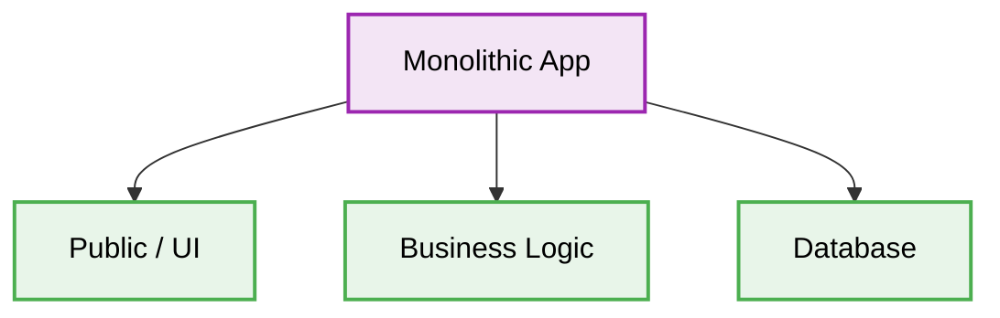

<div align="center">
  # 🏛️ Monolithic Architecture Production-Ready Best Practices
</div>
---

Этот инженерный директив определяет **лучшие практики (best practices)** для архитектуры Monolithic Architecture. Данный документ спроектирован для обеспечения максимальной масштабируемости, безопасности и качества кода при разработке приложений корпоративного уровня.
# Context & Scope
- **Primary Goal:** Предоставить строгие архитектурные правила и практические паттерны для создания масштабируемых систем.
- **Description:** The entire system components (Database, Message Queues, Business Logic, APIs) are deployed and operated from a single codebase on a single server.
## Map of Patterns
- 📊 [**Data Flow:** Request and Event Lifecycle](./data-flow.md)
- 📁 [**Folder Structure:** Layering logic](./folder-structure.md)
- ⚖️ [**Trade-offs:** Pros, Cons, and System Constraints](./trade-offs.md)
- 🛠️ [**Implementation Guide:** Code patterns and Anti-patterns](./implementation-guide.md)

### Structural Comparison: Monolithic Architecture vs Microservices

| Feature | Monolithic Architecture | Microservices |
| :--- | :--- | :--- |
| **Deployment** | Single unit (all or nothing) | Independent per service |
| **Scalability** | Scale the whole application | Scale specific components |
| **Technology Stack** | Uniform (hard to change) | Diverse (easy to adopt new tech) |
| **Complexity** | Lower initially, higher as it grows | Higher initially, manageable at scale |
| **Data Management** | Shared database | Database per service |

## Architecture Diagram



## Core Principles

1. **Isolation & Testability:** Changing a single feature doesn't break the entire business process.
2. **Strict Boundaries:** Enforce rigid structural barriers between business logic and infrastructure.
3. **Decoupling:** Decouple how data is stored from how it is queried and displayed.

## 1. Tightly Coupled Internal Modules (Spaghetti Code)

### ❌ Bad Practice
```typescript
// PaymentModule directly accessing Database tables of UserModule
import { db } from '../database';

export class PaymentProcessor {
  async chargeUser(userId: string, amount: number) {
    // Reaching across boundaries to read foreign tables directly
    const user = await db.query(`SELECT * FROM users WHERE id = '${userId}'`);

    if (user.balance >= amount) {
      // Direct mutation of foreign state
      await db.query(`UPDATE users SET balance = balance - ${amount}`);
      await db.query(`INSERT INTO payments ...`);
    }
  }
}
```

### ⚠️ Problem
Directly accessing tables or internal state of other modules within a monolith creates a "Big Ball of Mud". Changing the `users` table schema will silently break the `PaymentModule`. This prevents the monolith from ever being safely split into microservices in the future.

### ✅ Best Practice
```typescript
// PaymentModule interacting with UserModule via an explicit Interface/Facade
import { UserService } from '../users/user.service';

export class PaymentProcessor {
  constructor(private readonly userService: UserService) {}

  async chargeUser(userId: string, amount: number) {
    // Calling the defined contract API, unaware of underlying tables
    const user = await this.userService.getUserById(userId);

    if (user.canAfford(amount)) {
      await this.userService.deductBalance(userId, amount);
      await this.savePaymentRecord(userId, amount);
    }
  }
}
```

### 🚀 Solution
> [!IMPORTANT]
> Treat logical modules inside the monolith as if they were independent microservices. Enforce strict boundaries. Modules must only communicate with each other through explicit public interfaces (Facades or Services). Never share database queries or raw internal state across domain boundaries. This creates a "Modular Monolith" that is deterministic and ready for future extraction.


> [!NOTE]
> **Internal Routing:** For more context, refer back to the [Architecture Map](../readme.md).
