# Architecture Best Practices & Production-Ready Patterns

[🏠 На главную](../README.md)

# Context & Scope
- **Primary Goal:** Establish definitive rules and best practices for system design and architecture.
- **Target Tooling:** Cursor, Windsurf, Antigravity.
- **Tech Stack Version:** Agnostic

<div align="center">
  
  
  **The foundation for scalable, maintainable, and reliable applications.**
</div>
---
## 🌟 The Importance of Architecture in Modern Projects

In a world where application logic becomes more complex every day, **Architecture** is not just a folder structure; it is the set of laws by which your code lives. A proper architecture solves three key problems:
1. **Scalability:** Allows a project to grow alongside its team and features without turning into unmaintainable spaghetti code.
2. **Collaboration:** Lowers the barrier to entry for new developers (since everything has a strictly defined place) and reduces merge conflicts.
3. **Isolation & Testability:** Changing a single feature doesn't break the entire business process, because the logic is isolated from the UI and third-party libraries.

Without strict architecture, even the most modern frameworks (Angular, React, Vue, NestJS) quickly become unmanageable.
---
## 💡 Best Tips for Choosing an Architecture

Don't know where to start? Here are a few golden rules:
- > [!IMPORTANT]
  > **Consider Project Scope:** For unambiguous MVPs and pet projects, a classic *MVC* or *Monolith* is perfect. Don't overengineer your project with *Microservices* right from the start.
- **Separation of Concerns:** Whichever architecture you choose, always decouple how data is stored (DB) from how it is displayed (UI).
- **Match Your Team's Expertise:** Choose the approach that your team understands or is ready to learn. If everyone knows React inside out, use *FSD*. Lone wolves ruin team productivity.
- **Embrace Change:** The perfect architecture allows you to painlessly swap your database (e.g., PostgreSQL for MongoDB) or your UI component library without rewriting the core.
---
## 🗺️ Map of Patterns

- [Backend-For-Frontend (BFF)](./backend-for-frontend/readme.md)
- [Clean Architecture](./clean-architecture/readme.md)
- [CQRS](./cqrs/readme.md)
- [Domain-Driven Design (DDD)](./domain-driven-design/readme.md)
- [Event-Driven Architecture (EDA)](./event-driven-architecture/readme.md)
- [Event Sourcing](./event-sourcing/readme.md)
- [Feature-Sliced Design (FSD)](./feature-sliced-design/readme.md)
- [Hexagonal Architecture](./hexagonal-architecture/readme.md)
- [Micro-frontends](./micro-frontends/readme.md)
- [Microservices](./microservices/readme.md)
- [MVC (Model-View-Controller)](./model-view-controller/readme.md)
- [Monolithic Architecture](./monolithic-architecture/readme.md)
- [Space-Based Architecture](./space-based-architecture/readme.md)
- [Serverless](./serverless/readme.md)
- [Agentic Architecture (AI Agent Orchestration)](./agentic-architecture/readme.md)

## 🏆 Top 15 Best Architectural Approaches

Below are the most popular architectural patterns along with examples, tips, technology stacks, and their logos. A Folder Tree is provided for each to give you a deep understanding of its structure.
---

### 1. Feature-Sliced Design (FSD)


**Description:** A modern architectural methodology for Frontend applications. It separates code by business meaning (features) and technical layers. It ensures strict unidirectional isolation.
**📖 Map of Patterns:** [Go to FSD Guidelines](./feature-sliced-design/readme.md)

**Architecture Diagram & Folder Tree:**
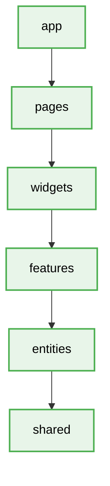

```text
src/
├── 📁 app/        # Global app setup (Global Store, Global CSS, Router init)
├── 📁 pages/      # Pages and Routing
├── 📁 widgets/    # Complex, independent UI blocks (Header, Footer)
├── 📁 features/   # Business-value user actions (UserAuth, AddToCart)
├── 📁 entities/   # Core business entities (User, Product)
└── 📁 shared/     # Reusable code (UI-components, API, utils)
```
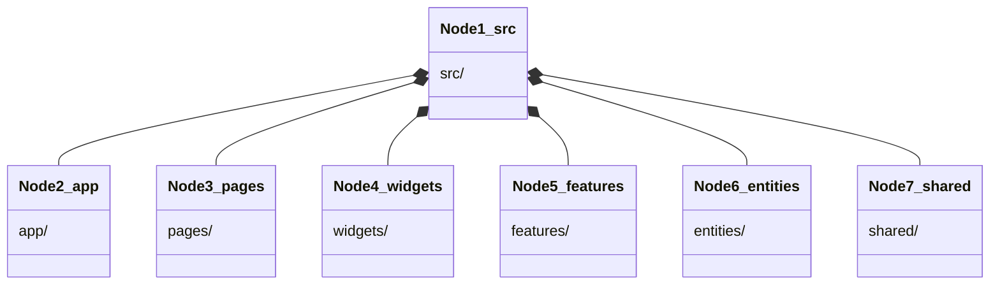

**Best Compatibility:**
- **Frameworks:**  React,  Vue,  Angular
- **Languages:**  TypeScript
- **Patterns / Principles:** Public API, Low Coupling, High Cohesion.
- **Tools/Libraries:** Redux Toolkit, Zustand, React Router.
---

### 2. Clean Architecture
[](#)

> [!IMPORTANT]
> **Description:** A concept created by Robert C. Martin (Uncle Bob). It separates a project into concentric rings. The main rule is the Dependency Rule: dependencies MUST STRICTLY only point inward (towards core business entities).
**📖 Map of Patterns:** [Go to Clean Architecture Guidelines](./clean-architecture/readme.md)

**Architecture Diagram & Folder Tree:**
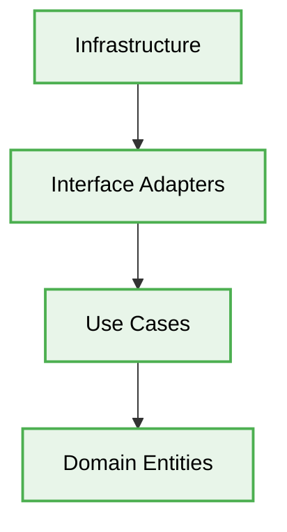

```text
src/
├── 📁 domain/               # The heart of the system: Entities and Interfaces
├── 📁 usecases/             # Business Scenarios (Interactors) - "What the system does"
├── 📁 interface-adapters/   # Controllers, Presenters, Gateways (Data translators)
└── 📁 infrastructure/       # The outside world: DB Repositories, Frameworks, UI
```

**Best Compatibility:**
- **Frameworks:**  NestJS,  Spring Boot
- **Languages:**  C#,  Java,  TypeScript
- **Patterns / Principles:** SOLID, Dependency Injection (DI), Repository.
- **Tools/Libraries:** ORMs (TypeORM, Prisma).
---

### 3. MVC (Model-View-Controller)
[](#)

**Description:** The classic design pattern for user-facing applications. It separates data logic (`Model`), presentation (`View`), and user action handling (`Controller`).
**📖 Map of Patterns:** [Go to MVC Guidelines](./model-view-controller/readme.md)

**Architecture Diagram & Folder Tree:**
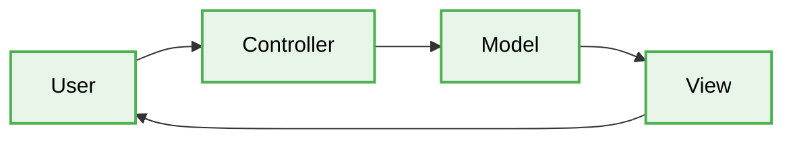

```text
src/
├── 📁 models/        # Database schemas and data manipulation methods
├── 📁 views/         # Templates (HTML, Pug, EJS) or React views
├── 📁 controllers/   # HTTP request handlers bridging Model and View
└── 📁 routes/        # API endpoint definitions (URLs)
```

**Best Compatibility:**
- **Frameworks:**  Express.js,  Ruby on Rails,  Laravel,  Django
- **Languages:**  Ruby,  PHP,  Python
- **Patterns / Principles:** Active Record, REST, DRY.
---

### 4. Microservices


**Description:** Breaking down a giant monolithic system into small, independent pieces, each handling its own business capability. Each service has its own Database and communicates via REST, gRPC, or events.
**📖 Map of Patterns:** [Go to Microservices Guidelines](./microservices/readme.md)

**Architecture Diagram & Folder Tree:**
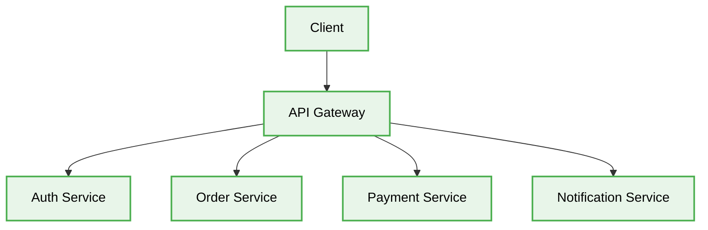

```text
microservices-cluster/
├── 📁 auth-service/         # Authentication Microservice (w/ PostgreSQL)
├── 📁 order-service/        # Orders Microservice (w/ MongoDB)
├── 📁 payment-service/      # Transaction logic layer
├── 📁 notification-service/ # Email and Push notifications
└── 📁 api-gateway/          # Router for all external client requests
```

**Best Compatibility:**
- **Frameworks:**  Spring Boot (Netflix OSS),  NestJS (Microservices module)
- **Languages:**  Go,  Java,  Node.js
- **Patterns / Principles:** API Gateway, Circuit Breaker, Saga Pattern.
- **Tools:**  Docker,  Kubernetes, gRPC.
---

### 5. Hexagonal Architecture (Ports & Adapters)
[](#)

**Description:** A logical evolution of Clean Architecture. The core of the system is isolated from specific technologies. All interaction with databases, UI, and side-effects happens through "Ports" (Interfaces), satisfying via "Adapters" (Implementations).
**📖 Map of Patterns:** [Go to Hexagonal Architecture Guidelines](./hexagonal-architecture/readme.md)

**Architecture Diagram & Folder Tree:**
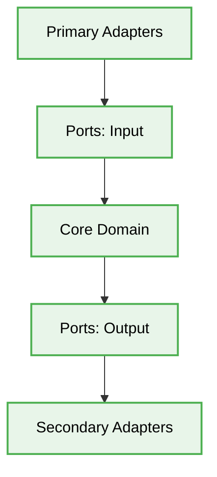

```text
src/
├── 📁 core/                 # Ports (Interfaces) and strict Domain
│   ├── 📁 ports/            # IUserRepository.ts
│   └── 📁 domain/           # Business rules for the application
└── 📁 adapters/             # Concrete implementations (Adapters)
    ├── 📁 primary/          # HTTP Controllers, GraphQL (System Entry)
    └── 📁 secondary/        # MongoAdapter.ts, PostgresAdapter.ts (System Exit)
```

**Best Compatibility:**
- **Frameworks:** Any strictly-typed IoC frameworks.
- **Languages:**  TypeScript,  C#
- **Patterns / Principles:** SOLID, Dependency Inversion (D in SOLID), Adapter.
---

### 6. DDD (Domain-Driven Design)
[](#)

**Description:** A philosophy and design approach centered entirely around the business "Domain". The whole team communicates using a "Ubiquitous Language," and domains are split into `Bounded Contexts`.
**📖 Map of Patterns:** [Go to DDD Guidelines](./domain-driven-design/readme.md)

**Architecture Diagram & Folder Tree:**
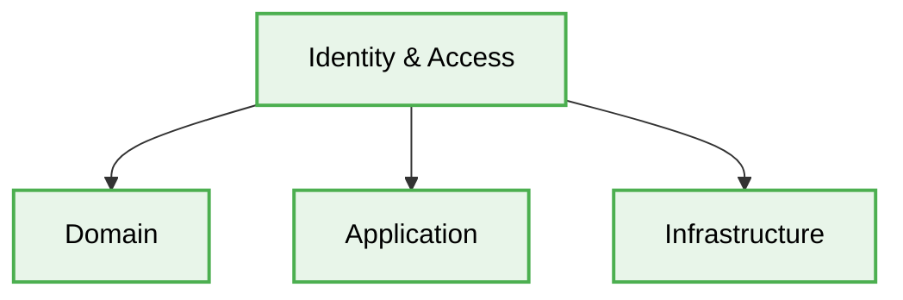

```text
src/
├── 📁 identity-access/      # Bounded Context (Auth domain)
│   ├── 📁 domain/           # Aggregates, Value Objects, Entities
│   ├── 📁 application/      # Command Handlers (Business Use Cases)
│   └── 📁 infrastructure/   # DB Repositories
└── 📁 content-management/   # Bounded Context (Articles domain)
    ├── 📁 domain/
    └── ...
```

**Best Compatibility:**
- **Frameworks:** Complex Backend ERP or Banking systems.
- **Languages:** Highly-typed OOP languages (Java, C#, TypeScript).
- **Patterns / Principles:** Bounded Contexts, Value Objects, Aggregates.
---

### 7. Event-Driven Architecture (EDA)
 

**Description:** System components know nothing about each other (Low Coupling). They merely "publish" events and "subscribe" to them, reacting asynchronously. Ideal for high-load, highly-scalable backend systems.
**📖 Map of Patterns:** [Go to Event-Driven Architecture Guidelines](./event-driven-architecture/readme.md)
**📖 Map of Patterns:** [Go to EDA Guidelines](./event-driven-architecture/readme.md)

**Architecture Diagram & Folder Tree:**
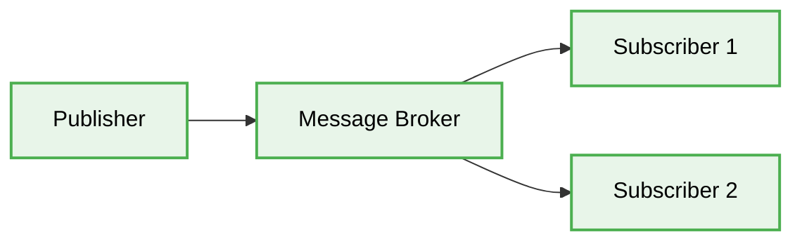

```text
src/
├── 📁 publishers/           # Generate events (e.g., OrderPayedEvent)
├── 📁 subscribers/          # Listen to events (e.g., NotifyUserListener)
├── 📁 events/               # Type definitions for event payloads
└── 📁 brokers/              # Connection configurations to message brokers
```

**Best Compatibility:**
- **Frameworks/Platforms:** Node.js, Spring Cloud.
- **Tools/Libraries:** Apache Kafka, RabbitMQ, Redis Pub/Sub, AWS EventBridge.
- **Patterns / Principles:** Pub/Sub, Async Communication, Event Sourcing.
---

### 8. Serverless (Function-as-a-Service / FaaS)
 

**Description:** Developers do not manage servers at all. The entire "server" consists of bite-sized pieces of business logic (functions/Lambdas) living in the cloud, executed only via triggers. You pay solely for compute execution time.
**📖 Map of Patterns:** [Go to Serverless Guidelines](./serverless/readme.md)

**Architecture Diagram & Folder Tree:**
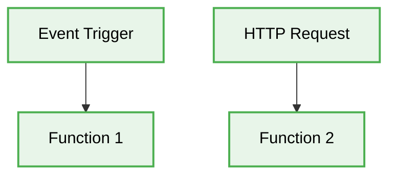

```text
project-functions/
├── 📁 user-signup/        # Cloud Function (Lambda) for registration
│   ├── index.js           # Function entry point (exports.handler)
│   └── package.json       # Dependencies specific to this function alone
├── 📁 process-payment/    # Cloud Function to process Stripe payments
└── serverless.yml         # Deployment config for AWS / GCP (Serverless Framework)
```

**Best Compatibility:**
- **Frameworks:** Serverless Framework, AWS SAM. Clouds:  Firebase, Vercel Functions.
- **Languages:**  Node.js, Python, Go (Languages with O(1) or O(n) cold starts).
- **Patterns / Principles:** Backend-as-a-Service (BaaS), Vendor Lock-in (use cautiously).
---

### 9. Monolithic Architecture
[](#)

**Description:** The entire system components (Database, Message Queues, Business Logic, APIs) are deployed and operated from a single codebase on a single server. This is the optimal start for startups to avoid unnecessary complexity upfront. 
**📖 Map of Patterns:** [Go to Monolithic Architecture Guidelines](./monolithic-architecture/readme.md)

**Architecture Diagram & Folder Tree:**
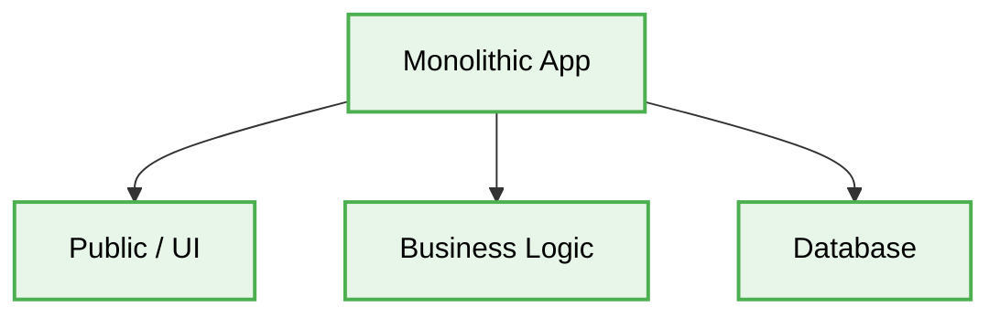

```text
monolith-app/
├── 📁 public/        # Static files for the server (incl. bundled React UI)
├── 📁 config/        # Environment configurations (DB, S3)
├── 📁 src/           # All business logic (Controllers, Services)
└── 📁 workers/       # Background processes (e.g., Queue processing)
```

**Best Compatibility:**
- **Frameworks:** Django, Ruby on Rails, NestJS (without microservices).
- **Languages:**  Python,  PHP,  Ruby.
- **Patterns / Principles:** Three-Tier Architecture, KISS, YAGNI.
---

### 10. CQRS (Command Query Responsibility Segregation)
[](#)

**Description:** A powerful pattern where Commands (actions that mutate system data) are entirely decoupled from Queries (actions that only read data). This separation enables extremely sophisticated load distribution.
**📖 Map of Patterns:** [Go to CQRS Guidelines](./cqrs/readme.md)

**Architecture Diagram & Folder Tree:**
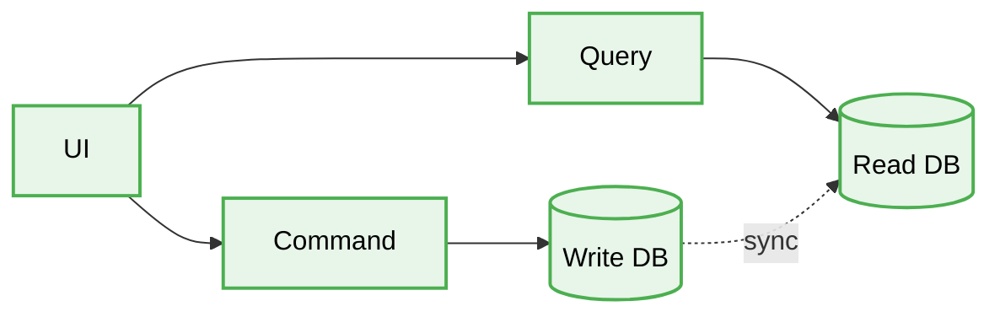

```text
src/
├── 📁 commands/           # Mutates system state
│   ├── CreateUserCommand.ts   # The incoming data structure
│   └── CreateUserHandler.ts   # Logic: Writes to the heavy Main DB (Postgres)
└── 📁 queries/            # Exclusively reading data
    ├── GetUserQuery.ts
    └── GetUserHandler.ts      # Logic: Reads from a blazing fast DB (Elastic/Redis)
```

**Best Compatibility:**
- **Frameworks:** NestJS (`@nestjs/cqrs`), MediatR (.NET).
- **Languages:** Strongly-typed languages (TypeScript, C#).
- **Patterns / Principles:** Event Sourcing, CQS, Mediator.
- **Tools/Databases:**  PostgreSQL (Command DB),  ElasticSearch or Redis (Query DB).

---

### 11. Micro-frontends
[](#)

**Description:** An architectural style where independently deliverable frontend applications are composed into a greater whole. This enables multiple teams to work simultaneously without stepping on each other's toes, making scaling enterprise frontends deterministic.
**📖 Map of Patterns:** [Go to Micro-frontends Guidelines](./micro-frontends/readme.md)

**Architecture Diagram & Folder Tree:**
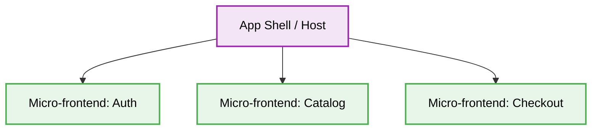

```text
workspace/
├── 📁 apps/
│   ├── 📁 app-shell/     # Entry point, Router, Module Federation config
│   ├── 📁 mfe-catalog/   # Independent application
│   └── 📁 mfe-checkout/  # Independent application
└── 📁 packages/
    ├── 📁 design-system/ # Pure, dumb UI components only
    └── 📁 event-bus/     # Agnostic communication contract types
```

**Best Compatibility:**
- **Frameworks:**  React,  Vue,  Angular.
- **Languages:**  TypeScript.
- **Patterns / Principles:** Module Federation, Event-Driven Communication.
- **Tools:** Webpack 5, Vite.

---

### 12. Event Sourcing
[](#)

**Description:** A pattern where all changes to application state are stored as a sequence of events. Instead of storing just the current state of the data in a domain, use an append-only store to record the full series of actions taken on that data.
**📖 Map of Patterns:** [Go to Event Sourcing Guidelines](./event-sourcing/readme.md)

**Architecture Diagram & Folder Tree:**
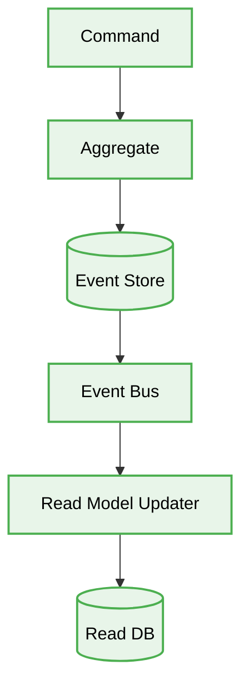

```text
src/
├── commands/
├── aggregates/
├── events/
├── projections/
└── infrastructure/
    └── event-store/
```

- **When to use:** When you need a complete audit log, temporal queries, or when decoupling read and write models is critical.
- **Patterns / Principles:** Event Log, CQRS, Projections, Snapshots.

---

### 13. Backend-For-Frontend (BFF)
[](#)

**Description:** A pattern where a separate backend service is created for each specific frontend application or interface type, rather than having a single general-purpose API backend for all clients. This allows the backend to be optimized for the specific needs of the frontend.
**📖 Map of Patterns:** [Go to Backend-For-Frontend (BFF) Guidelines](./backend-for-frontend/readme.md)

**Architecture Diagram & Folder Tree:**
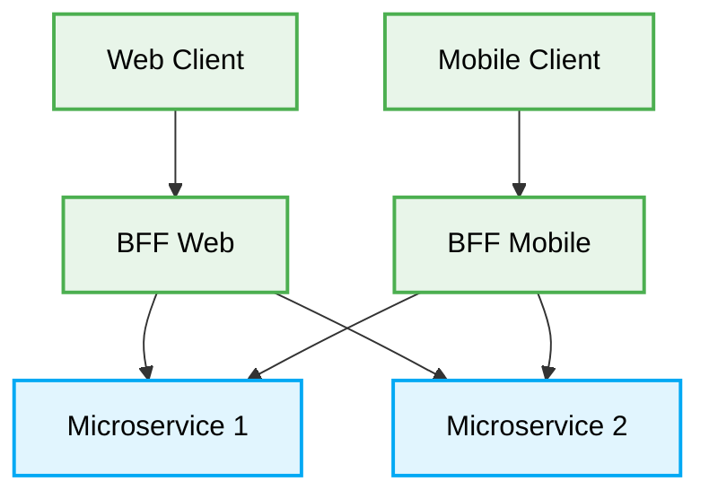

```text
src/
├── 📁 routes/           # Route definitions mapped to controllers
├── 📁 controllers/      # Handles incoming requests from specific clients
├── 📁 services/         # Aggregates data from multiple downstream APIs
└── 📁 clients/          # Logic to call downstream Microservices
```

**Best Compatibility:**
- **Frameworks:** NestJS, Express.js.
- **Languages:**  TypeScript, Node.js.
- **Patterns / Principles:** API Gateway, Microservices, API Composition.


---

### 14. Space-Based Architecture
[](#)

**Description:** A pattern designed to minimize the constraints of a central database by keeping state in an in-memory data grid. The architecture relies on "processing units" that independently execute logic and communicate with each other or the grid.
**📖 Map of Patterns:** [Go to Space-Based Architecture Guidelines](./space-based-architecture/readme.md)

**Architecture Diagram & Folder Tree:**
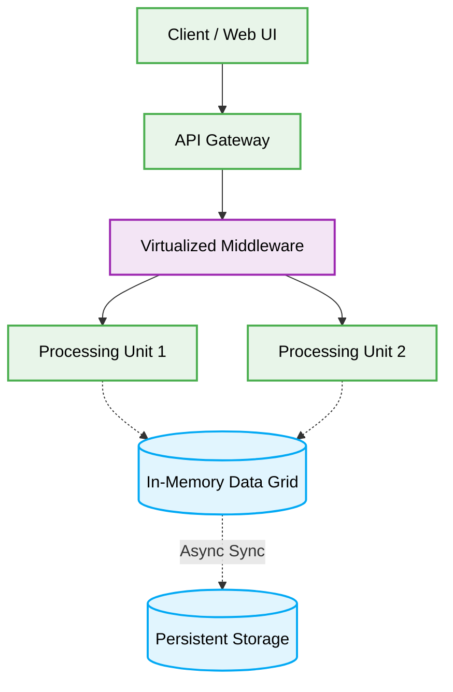

```text
src/
├── 📁 processing-units/ # Independent logic components
├── 📁 virtual-middleware/ # Handles messaging and grid routing
└── 📁 grid-storage/     # In-Memory Data Grid operations
```

**Best Compatibility:**
- **Frameworks:** Hazelcast, Apache Ignite, GigaSpaces.
- **Languages:**  Java,  C#,  Go.
- **Patterns / Principles:** High-performance caching, Distributed systems.

---

### 15. Agentic Architecture (AI Agent Orchestration)
[](#)

**Description:** An architecture that orchestrates multiple specialized AI agents, distributing complex workloads to optimize token efficiency, reduce context window overflow, and ensure deterministic, resilient outcomes.
**📖 Map of Patterns:** [Go to Agentic Architecture Guidelines](./agentic-architecture/readme.md)

**Architecture Diagram & Folder Tree:**
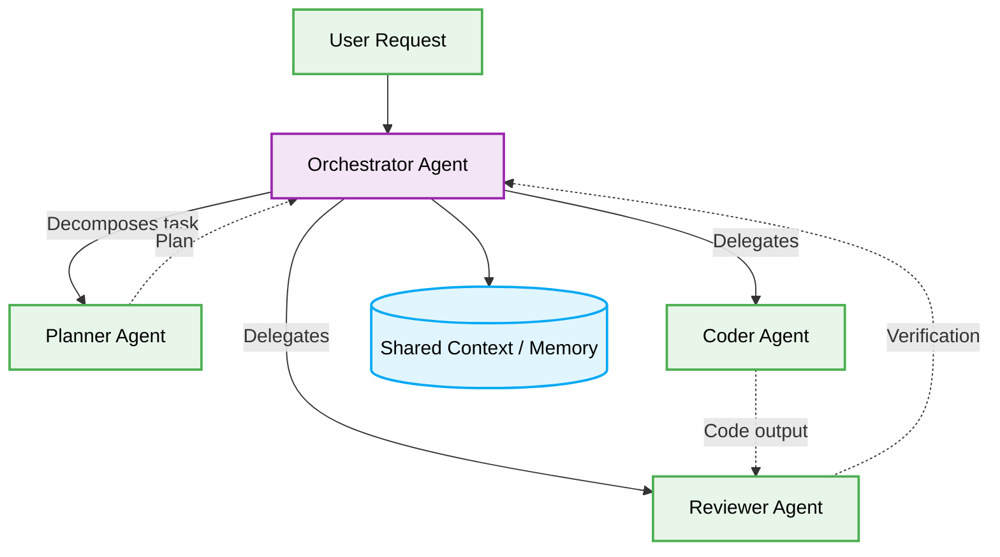

```text
src/
├── 📁 orchestrator/     # Main coordinator agent
├── 📁 workers/          # Specialized worker agents (Planner, Coder, Reviewer)
└── 📁 memory/           # Shared context and validation schemas
```

**Best Compatibility:**
- **Frameworks:** LangChain, AutoGen, CrewAI.
- **Languages:**  Python,  TypeScript.
- **Patterns / Principles:** Orchestrator-Worker, Map-Reduce, Multi-Agent Systems.
---

### 16. Microkernel Architecture (Plugin Architecture)
[](#)

**Description:** An architecture that strictly isolates essential business rules (the Core) from volatile, domain-specific, or external-facing logic (the Plugins). It guarantees O(1) impact on the core when adding or modifying auxiliary features.
**📖 Map of Patterns:** [Go to Microkernel Architecture Guidelines](./microkernel-architecture/readme.md)

**Architecture Diagram & Folder Tree:**
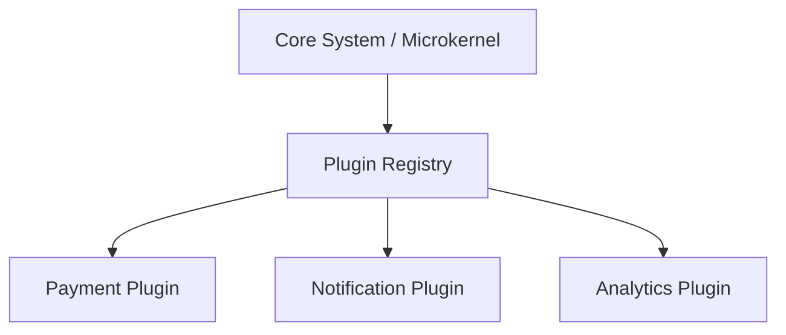

```text
src/
├── 📁 core/             # Core system orchestrator and registry interfaces
├── 📁 plugins/          # Independent modules implementing core interfaces
└── 📁 shared/           # Data types and common utilities
```

**Best Compatibility:**
- **Frameworks:** Eclipse, VS Code, Webpack, Babel.
- **Languages:**  TypeScript,  Java,  Python.
- **Patterns / Principles:** Open/Closed Principle, Dependency Inversion, Registry Pattern.
