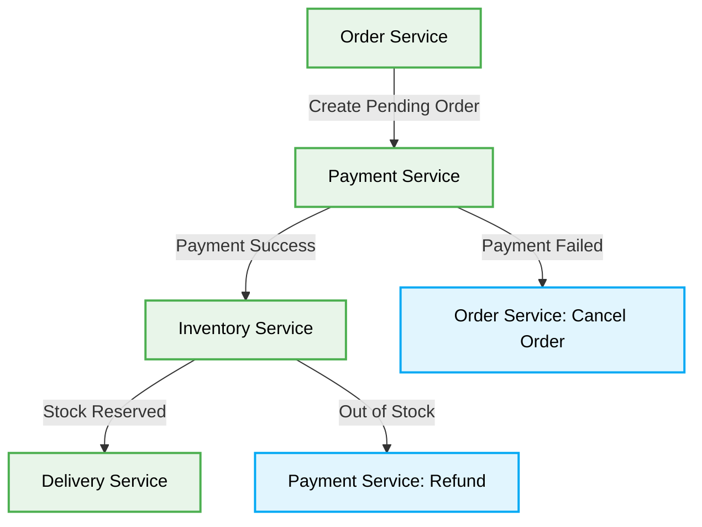

# 🔄 Saga Pattern Production-Ready Best Practices

[🏠 На главную](../README.md)

# Context & Scope
- **Primary Goal:** Document and execute the best practices for the Saga Pattern in distributed systems.
- **Target Tooling:** AI Agents and Human Developers.
- **Tech Stack Version:** Agnostic

<div align="center">
  

  **Distributed transactions without two-phase commit.**
</div>

---
## 🗺️ Map of Patterns (Saga Modules)

This architecture defines how to maintain data consistency across microservices in distributed transaction scenarios without relying on distributed locks (2PC).



## 🚀 The Core Philosophy

The Saga Pattern manages distributed transactions by breaking them down into a sequence of local transactions. Each service updates its local database and publishes an event or message to trigger the next step. If a step fails, compensating transactions are executed to undo the preceding steps.

> [!IMPORTANT]
> **AI Constraint:** Agents MUST implement explicit compensation logic (rollback functions) for every local transaction that modifies state in a Saga.

---

## 1. Monolithic Distributed Transactions (2PC)

### ❌ Bad Practice
```typescript
class OrderService {
  async checkout(orderData: any) {
    // Attempting synchronous 2PC across microservices
    const orderTx = await this.db.startTransaction();
    try {
      await this.createLocalOrder(orderData, orderTx);
      await ExternalPaymentAPI.charge(orderData.amount);
      await ExternalInventoryAPI.reserve(orderData.items);
      await orderTx.commit();
    } catch (e) {
      await orderTx.rollback();
      throw new Error("Distributed transaction failed!");
    }
  }
}
```

### ⚠️ Problem
Using synchronous remote calls wrapped inside a local database transaction (or attempting Two-Phase Commit) creates massive bottlenecks and latency. If the `ExternalInventoryAPI` times out, the local `orderTx` remains locked indefinitely. This destroys scalability and resilience, causing the entire system to hang.

### ✅ Best Practice
```typescript
// Choreography-based Saga Implementation
class OrderService {
  async createPendingOrder(orderData: Order) {
    // 1. Save local state as PENDING immediately
    const order = await this.db.orders.create({ ...orderData, status: 'PENDING' });

    // 2. Emit event for the next service to react
    await this.eventBus.publish('OrderCreated', { orderId: order.id, amount: orderData.amount });
    return order;
  }

  // Compensating transaction handler
  async handlePaymentFailed(event: PaymentFailedEvent) {
    await this.db.orders.update(event.orderId, { status: 'CANCELLED' });
  }
}

class PaymentService {
  async handleOrderCreated(event: OrderCreatedEvent) {
    try {
      await this.charge(event.amount);
      await this.eventBus.publish('PaymentSuccess', { orderId: event.orderId });
    } catch (e) {
      // 3. Emit failure event to trigger compensation
      await this.eventBus.publish('PaymentFailed', { orderId: event.orderId, reason: e.message });
    }
  }
}
```

### 🚀 Solution
Implementing the Saga Pattern (via Choreography or Orchestration) guarantees high availability and scalability. Local database locks are held only for milliseconds. Event-driven compensations (`PaymentFailed` triggering order cancellation) ensure eventual consistency without the catastrophic blocking of synchronous distributed transactions. This is deterministic, easily testable, and completely scalable.
