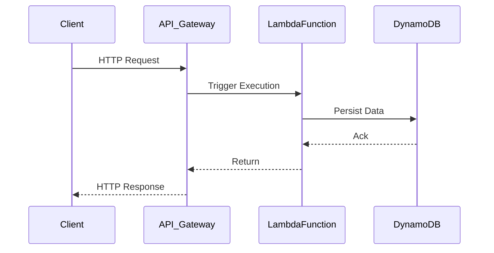

# Serverless - Data Flow

## Request and Event Lifecycle

```mermaid
sequenceDiagram
    participant Client
    participant API_Gateway
    participant LambdaFunction
    participant DynamoDB

    Client->>API_Gateway: HTTP Request
    API_Gateway->>LambdaFunction: Trigger Execution
    LambdaFunction->>DynamoDB: Persist Data
    DynamoDB-->>LambdaFunction: Ack
    LambdaFunction-->>API_Gateway: Return
    API_Gateway-->>Client: HTTP Response
```

### Constraints
- Functions must be stateless.
