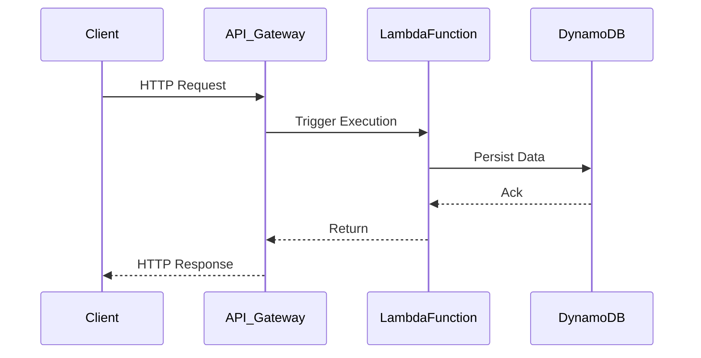

---
description: Vibe coding guidelines and architectural constraints for Serverless within the Architecture domain.
tags: [serverless, architecture, best-practices, architecture]
topic: Serverless
complexity: Architect
last_evolution: 2026-03-29
vibe_coding_ready: true
technology: Serverless
domain: Architecture
level: Senior/Architect
version: Latest
ai_role: Senior Serverless Expert
last_updated: 2026-03-29---# Serverless - Data Flow
## Request and Event Lifecycle

### Constraints
- Functions must be stateless.
