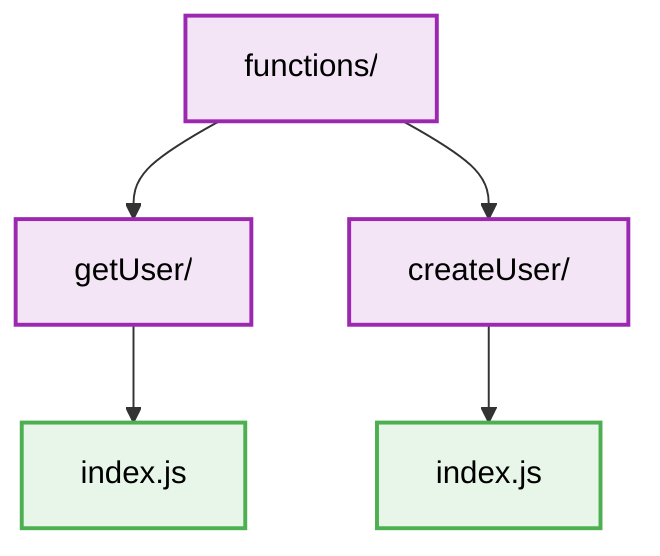

# Serverless - Folder Structure

## Layering logic

```mermaid
graph TD
    App[functions/] --> F1[getUser/]
    App --> F2[createUser/]
    F1 --> index[index.js]
    F2 --> index2[index.js]
    classDef default fill:#e1f5fe,stroke:#03a9f4,stroke-width:2px,color:#000;
    classDef component fill:#e8f5e9,stroke:#4caf50,stroke-width:2px,color:#000;
    classDef layout fill:#f3e5f5,stroke:#9c27b0,stroke-width:2px,color:#000;

    class App layout;
    class F1 layout;
    class F2 layout;
    class index component;
    class index2 component;
```

### Constraints
- Functions are self-contained.
