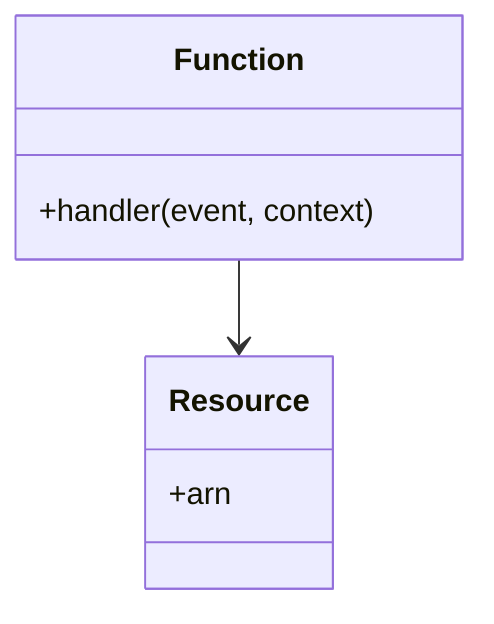

# Serverless - Implementation Guide

## Code patterns and Anti-patterns

### Entity Relationships

```mermaid
classDiagram
    class Function {
        +handler(event, context)
    }
    class Resource {
        +arn
    }
    Function --> Resource
```

### Rules
- Minimize dependencies to reduce cold start times.
