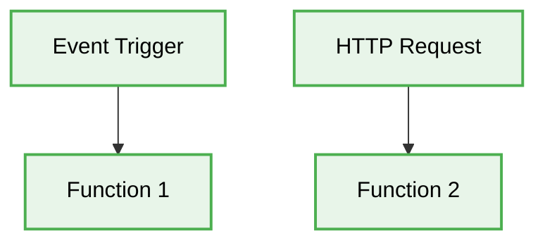

<div align="center">
  # 🏛️ Serverless Production-Ready Best Practices
</div>
---

Этот инженерный директив определяет **лучшие практики (best practices)** для архитектуры Serverless. Данный документ спроектирован для обеспечения максимальной масштабируемости, безопасности и качества кода при разработке приложений корпоративного уровня.

# 🎯 Context & Scope
- **Primary Goal:** Предоставить строгие архитектурные правила и практические паттерны для создания масштабируемых систем.
- **Description:** Developers do not manage servers at all. The entire "server" consists of bite-sized pieces of business logic (functions/Lambdas) living in the cloud.

## 🗺️ Map of Patterns
- 📊 [**Data Flow:** Request and Event Lifecycle](./data-flow.md)
- 📁 [**Folder Structure:** Layering logic](./folder-structure.md)
- ⚖️ [**Trade-offs:** Pros, Cons, and System Constraints](./trade-offs.md)
- 🛠️ [**Implementation Guide:** Code patterns and Anti-patterns](./implementation-guide.md)

## 🧱 Core Principles

1. **Isolation & Testability:** Changing a single feature doesn't break the entire business process.
2. **Strict Boundaries:** Enforce rigid structural barriers between business logic and infrastructure.
3. **Decoupling:** Decouple how data is stored from how it is queried and displayed.

## 📐 Architecture Diagram



---

## 🚧 1. The Monolithic Lambda (Fat Function)

### ❌ Bad Practice
```javascript
// A single Lambda function handling multiple distinct routes/actions
exports.handler = async (event) => {
  const { path, httpMethod, body } = event;

  if (path === '/users' && httpMethod === 'POST') {
    return await createUser(JSON.parse(body));
  } else if (path === '/users' && httpMethod === 'GET') {
    return await getUsers();
  } else if (path === '/products' && httpMethod === 'POST') {
    return await createProduct(JSON.parse(body));
  }

  return { statusCode: 404, body: 'Not Found' };
};
```

### ⚠️ Problem
Grouping unrelated endpoints into a single function defeats the purpose of Serverless. It increases the deployment package size (slowing down cold starts), couples business domains together, complicates IAM permissions (granting excessive privileges), and makes individual function metrics/tracing impossible.

### ✅ Best Practice
```javascript
// One function strictly mapped to one specific capability
// users-create.js
exports.handler = async (event) => {
  const payload = JSON.parse(event.body);
  return await createUser(payload);
};

// users-get.js
exports.handler = async (event) => {
  return await getUsers();
};
```

### 🚀 Solution
Embrace the "Single Responsibility Principle" at the infrastructure level. Decompose logic into granular, single-purpose functions. Use an API Gateway to handle routing rather than parsing paths inside the compute layer. This ensures precise IAM scoping, accurate observability, and isolated failure domains.

---

## 🚧 2. Stateful Execution Contexts

### ❌ Bad Practice
```javascript
// In-memory cache shared across invocations incorrectly
let databaseConnection = null;
let userCache = []; // BAD: State assumes the same instance will be hit

exports.handler = async (event) => {
  if (!databaseConnection) {
    databaseConnection = await createConnection();
  }

  if (userCache.length === 0) {
    userCache = await databaseConnection.query('SELECT * FROM users');
  }

  // Mutating the array mutates state for concurrent overlapping invocations
  userCache.push(JSON.parse(event.body));

  return { statusCode: 200, body: JSON.stringify(userCache) };
};
```

### ⚠️ Problem
Serverless environments are ephemeral. You cannot guarantee that subsequent requests will be routed to the same container instance. Relying on local variable state leads to unpredictable race conditions, phantom data bugs, and security leaks across tenant requests.

### ✅ Best Practice
```javascript
// Safely caching connections, but keeping data strictly stateless
let databaseConnection = null;

exports.handler = async (event) => {
  // Good: Reusing the connection pool across warm starts
  if (!databaseConnection) {
    databaseConnection = await createConnection();
  }

  // Data state is retrieved fresh or from an external distributed cache
  const users = await databaseConnection.query('SELECT * FROM users');
  const newUser = JSON.parse(event.body);

  await databaseConnection.query('INSERT INTO users...', newUser);

  return { statusCode: 200, body: JSON.stringify([...users, newUser]) };
};
```

### 🚀 Solution
Treat every function invocation as stateless. It is acceptable (and encouraged) to cache static assets or database connection pools globally (outside the handler) to reduce cold start latency. However, all business data, session state, or mutable variables must be strictly scoped to the handler's execution context or offloaded to Redis/DynamoDB.
