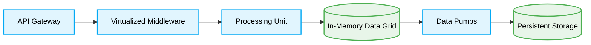

  # 🌊 Space-Based Architecture Data Flow

---

This document describes the request and event lifecycle in a Space-Based Architecture.

## 1. Request Handling

When a request enters the system, the API Gateway routes it to the Virtualized Middleware. The middleware then intelligently assigns the request to the appropriate Processing Unit based on the required operation and the partitioned data shard.

## 2. In-Memory Execution

The Processing Unit receives the request and interacts almost exclusively with the In-Memory Data Grid (IMDG). Because the data is held in memory, read and write operations occur at microsecond speeds. No synchronous calls are made to persistent storage.

## 3. Data Syncing

Modifications to the IMDG are captured and streamed via asynchronous Data Pumps. These background processes replicate the changes to a central Persistent Storage (Database). If a node fails, the data can be recovered from the persistent store to rehydrate the grid.

