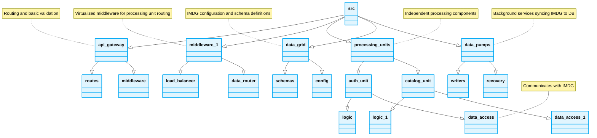

<div align="center">
  # 📁 Space-Based Architecture Folder Structure
</div>

---

This document outlines the strict directory blueprints for organizing logic within a Space-Based Architecture system.

```text
src/
├── api-gateway/            # Routing and basic validation
│   ├── routes/
│   └── middleware/
├── middleware/             # Virtualized middleware for processing unit routing
│   ├── load-balancer/
│   └── data-router/
├── processing-units/       # Independent processing components
│   ├── auth-unit/
│   │   ├── logic/
│   │   └── data-access/  # Communicates with IMDG
│   └── catalog-unit/
│       ├── logic/
│       └── data-access/
├── data-grid/              # IMDG configuration and schema definitions
│   ├── schemas/
│   └── config/
└── data-pumps/             # Background services syncing IMDG to DB
    ├── writers/
    └── recovery/
```



## Layering Logic

- **api-gateway:** The initial entry point. Minimal logic.
- **middleware:** Manages the grid and distributes the load to the Processing Units.
- **processing-units:** The core. Contains business logic. Interacts only with the `data-grid` layer.
- **data-grid:** Defines how data is structured and cached in memory.
- **data-pumps:** Contains asynchronous workers that take data from the grid and flush it to the permanent database.
