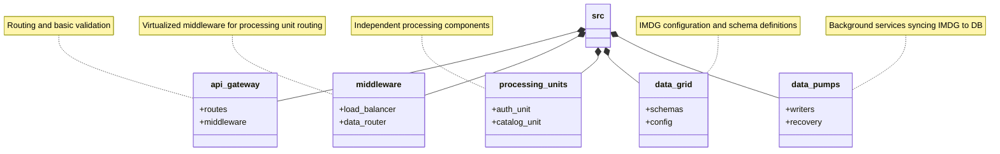

  # 📁 Space-Based Architecture Folder Structure

---

This document outlines the strict directory blueprints for organizing logic within a Space-Based Architecture system.

## Component Relations

```mermaid
classDiagram
    class src {
    }
    class api_gateway {
        +routes
        +middleware
    }
    class middleware {
        +load_balancer
        +data_router
    }
    class processing_units {
        +auth_unit
        +catalog_unit
    }
    class data_grid {
        +schemas
        +config
    }
    class data_pumps {
        +writers
        +recovery
    }

    src *-- api_gateway
    src *-- middleware
    src *-- processing_units
    src *-- data_grid
    src *-- data_pumps

    note for api_gateway "Routing and basic validation"
    note for middleware "Virtualized middleware for processing unit routing"
    note for processing_units "Independent processing components"
    note for data_grid "IMDG configuration and schema definitions"
    note for data_pumps "Background services syncing IMDG to DB"

    %% Design Tokens
    class api_gateway:::component
    class middleware:::layout
    class processing_units:::component
    class data_grid:::default
    class data_pumps:::default
```
