<div align="center">
  # 📁 Space-Based Architecture Folder Structure
</div>

---

This document outlines the strict directory blueprints for organizing logic within a Space-Based Architecture system.

```text
src/
├── api-gateway/            # Routing and basic validation
│   ├── routes/
│   └── middleware/
├── middleware/             # Virtualized middleware for processing unit routing
│   ├── load-balancer/
│   └── data-router/
├── processing-units/       # Independent processing components
│   ├── auth-unit/
│   │   ├── logic/
│   │   └── data-access/  # Communicates with IMDG
│   └── catalog-unit/
│       ├── logic/
│       └── data-access/
├── data-grid/              # IMDG configuration and schema definitions
│   ├── schemas/
│   └── config/
└── data-pumps/             # Background services syncing IMDG to DB
    ├── writers/
    └── recovery/
```

```mermaid
classDiagram
    class src
    class api_gateway
    class middleware
    class processing_units
    class data_grid
    class data_pumps

    src --> api_gateway
    src --> middleware
    src --> processing_units
    src --> data_grid
    src --> data_pumps

    note for api_gateway "Routing and basic validation\nroutes/, middleware/"
    note for middleware "Virtualized middleware for processing unit routing\nload-balancer/, data-router/"
    note for processing_units "Independent processing components\nauth-unit/, catalog-unit/"
    note for data_grid "IMDG configuration and schema definitions\nschemas/, config/"
    note for data_pumps "Background services syncing IMDG to DB\nwriters/, recovery/"

    cssClass src layout
    cssClass api_gateway component
    cssClass middleware component
    cssClass processing_units component
    cssClass data_grid component
    cssClass data_pumps component
```

```mermaid
classDiagram
    class src
    class api_gateway
    class middleware
    class processing_units
    class data_grid
    class data_pumps

    src --> api_gateway
    src --> middleware
    src --> processing_units
    src --> data_grid
    src --> data_pumps

    note for api_gateway "Routing and basic validation\nroutes/, middleware/"
    note for middleware "Virtualized middleware for processing unit routing\nload-balancer/, data-router/"
    note for processing_units "Independent processing components\nauth-unit/, catalog-unit/"
    note for data_grid "IMDG configuration and schema definitions\nschemas/, config/"
    note for data_pumps "Background services syncing IMDG to DB\nwriters/, recovery/"

    cssClass src layout
    cssClass api_gateway component
    cssClass middleware component
    cssClass processing_units component
    cssClass data_grid component
    cssClass data_pumps component
```



```mermaid
classDiagram
    class src:::layout
    class api_gateway:::component
    class middleware:::component
    class processing_units:::component
    class data_grid:::component
    class data_pumps:::component

    src --> api_gateway
    src --> middleware
    src --> processing_units
    src --> data_grid
    src --> data_pumps

    note for api_gateway "Routing and basic validation\nroutes/, middleware/"
    note for middleware "Virtualized middleware for processing unit routing\nload-balancer/, data-router/"
    note for processing_units "Independent processing components\nauth-unit/, catalog-unit/"
    note for data_grid "IMDG configuration and schema definitions\nschemas/, config/"
    note for data_pumps "Background services syncing IMDG to DB\nwriters/, recovery/"

    classDef default fill:#e1f5fe,stroke:#03a9f4,stroke-width:2px,color:#000;
    classDef component fill:#e8f5e9,stroke:#4caf50,stroke-width:2px,color:#000;
    classDef layout fill:#f3e5f5,stroke:#9c27b0,stroke-width:2px,color:#000;
```

## Layering Logic

- **api-gateway:** The initial entry point. Minimal logic.
- **middleware:** Manages the grid and distributes the load to the Processing Units.
- **processing-units:** The core. Contains business logic. Interacts only with the `data-grid` layer.
- **data-grid:** Defines how data is structured and cached in memory.
- **data-pumps:** Contains asynchronous workers that take data from the grid and flush it to the permanent database.
