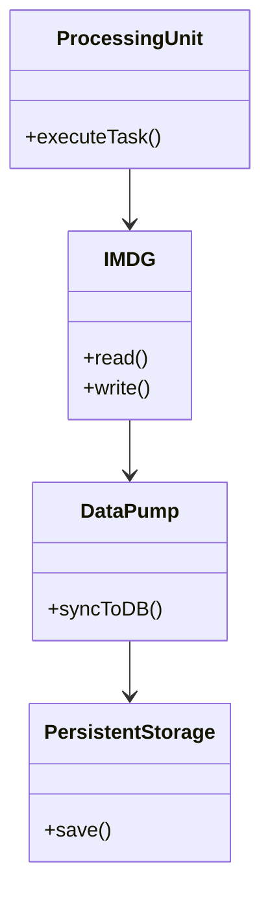

<div align="center">
  # 🛠️ Space-Based Architecture Implementation Guide
</div>

---

## Component Relationships



## 1. Synchronous Database Writes in Processing Units

### ❌ Bad Practice
```typescript
import { Database } from 'infrastructure/database';

class OrderProcessingUnit {
  constructor(private readonly db: Database) {}

  public async processOrder(orderData: any): Promise<void> {
    // 1. Process business logic
    const processedOrder = this.calculateTaxes(orderData);

    // 2. Synchronous write to persistent database inside the hot path
    await this.db.save(processedOrder);
  }

  private calculateTaxes(data: any): any {
    return { ...data, tax: 10 };
  }
}
```

### ⚠️ Problem
Directly writing to a persistent database synchronously within a Processing Unit defeats the entire purpose of the Space-Based Architecture. During high-traffic spikes, the database connection pool will exhaust, locks will accumulate, and the central database will become a catastrophic bottleneck, crashing the independent processing units waiting for disk I/O.

### ✅ Best Practice
```typescript
import { InvalidateType } from 'infrastructure/cache';

interface OrderData {
    id: string;
    amount: number;
}

interface ProcessedOrder extends OrderData {
    tax: number;
}

interface IMDGClient {
    put(key: string, value: unknown): Promise<void>;
}

class OrderProcessingUnit {
  constructor(private readonly imdg: IMDGClient) {}

  public async processOrder(orderData: unknown): Promise<void> {
    if (!this.isValidOrder(orderData)) {
      throw new Error("Invalid payload");
    }

    // 1. Process business logic
    const processedOrder = this.calculateTaxes(orderData);

    // 2. Lightning-fast write to In-Memory Data Grid ONLY
    await this.imdg.put(`order:${processedOrder.id}`, processedOrder);
  }

  private isValidOrder(data: unknown): data is OrderData {
    return typeof data === 'object' && data !== null && 'id' in data && 'amount' in data;
  }

  private calculateTaxes(data: OrderData): ProcessedOrder {
    return { ...data, tax: data.amount * 0.1 };
  }
}
```

### 🚀 Solution
STRICTLY decouple the hot transactional path from persistent disk I/O. The Processing Unit MUST only read and write state to the high-speed In-Memory Data Grid (IMDG). Asynchronous 'Data Pumps' (running in a separate thread or background service) take the responsibility of scanning the IMDG and eventually syncing the mutated state down to the persistent database. This guarantees deterministic, microsecond response times regardless of database load.
