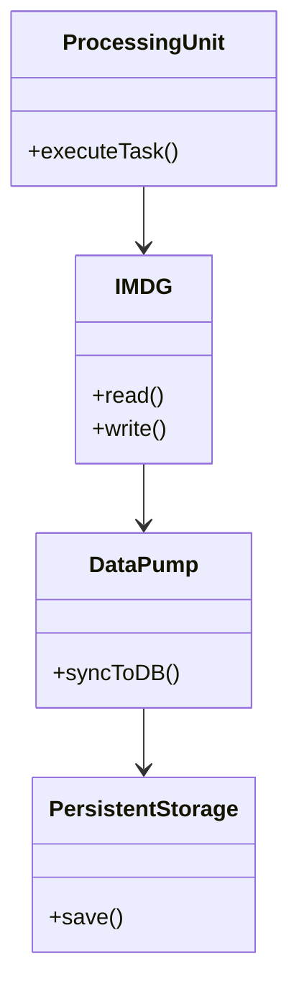

  # 🛠️ Space-Based Architecture Implementation Guide

---

## Code Patterns and Anti-patterns

### Component Relationships

```mermaid
classDiagram
    class ProcessingUnit {
        +executeTask()
    }
    class IMDG {
        +read()
        +write()
    }
    class DataPump {
        +syncToDB()
    }
    class PersistentStorage {
        +save()
    }
    ProcessingUnit --> IMDG
    IMDG --> DataPump
    DataPump --> PersistentStorage
```

