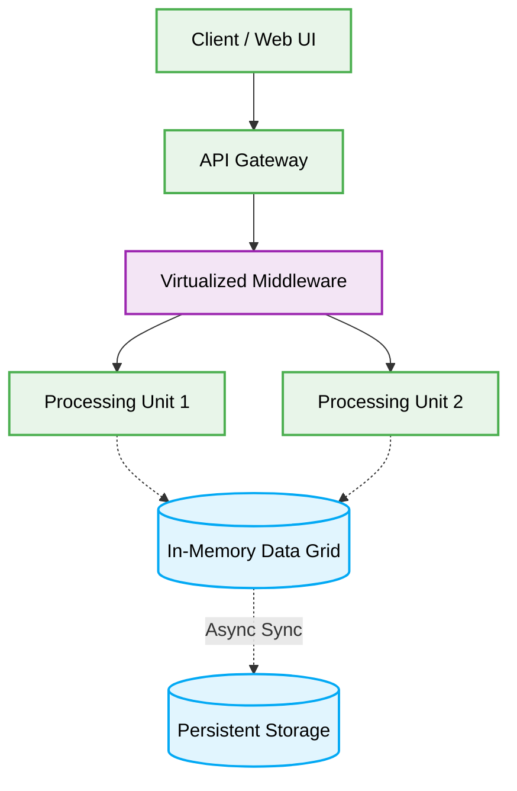

<div align="center">
  # 🌌 Space-Based Architecture Production-Ready Best Practices
</div>

---

This engineering directive defines the **best practices** for the Space-Based Architecture (SBA). This document is designed to ensure maximum scalability, security, and code quality when developing applications that require extreme high-performance and low-latency under unpredictable, fluctuating user loads.

[🏠 На главную](../readme.md)

## 🎯 Context & Scope
- **Primary Goal:** Provide strict architectural rules and practical patterns for building systems that rely on distributed in-memory data grids to eliminate database bottlenecks.
- **Description:** A pattern designed to minimize the constraints of a central database by keeping state in an in-memory data grid. The architecture relies on "processing units" that independently execute logic and communicate with each other or the grid.

## 🗺️ Map of Patterns
- 📊 [**Data Flow:** Request and Event Lifecycle](./data-flow.md)
- 📁 [**Folder Structure:** Layering logic](./folder-structure.md)
- ⚖️ [**Trade-offs:** Pros, Cons, and System Constraints](./trade-offs.md)
- 🛠️ [**Implementation Guide:** Code patterns and Anti-patterns](./implementation-guide.md)

## 📐 Architecture Diagram



---

## 🧱 Core Principles

1. **Database Bottleneck Elimination:** Traditional central databases act as a choke point during high load. SBA completely avoids synchronous DB writes in the critical request path.
2. **In-Memory Data Grid (IMDG):** The state is aggressively cached and maintained in an IMDG, providing microsecond access times for Processing Units.
3. **Independent Processing Units:** Microservices or components that contain business logic and operate over small shards of data, executing autonomously.
4. **Asynchronous Persistence:** The IMDG eventually syncs data back to a persistent store in the background, out of the hot path.

## 🚧 1. Synchronous Database Writes in Processing Units

### ❌ Bad Practice
```typescript
import { Database } from 'infrastructure/database';

class OrderProcessingUnit {
  constructor(private readonly db: Database) {}

  public async processOrder(orderData: any): Promise<void> {
    // 1. Process business logic
    const processedOrder = this.calculateTaxes(orderData);

    // 2. Synchronous write to persistent database inside the hot path
    await this.db.save(processedOrder);
  }

  private calculateTaxes(data: any): any {
    return { ...data, tax: 10 };
  }
}
```

### ⚠️ Problem
Directly writing to a persistent database synchronously within a Processing Unit defeats the entire purpose of the Space-Based Architecture. During high-traffic spikes, the database connection pool will exhaust, locks will accumulate, and the central database will become a catastrophic bottleneck, crashing the independent processing units waiting for disk I/O.

### ✅ Best Practice
```typescript
import { InvalidateType } from 'infrastructure/cache';

interface OrderData {
    id: string;
    amount: number;
}

interface ProcessedOrder extends OrderData {
    tax: number;
}

interface IMDGClient {
    put(key: string, value: unknown): Promise<void>;
}

class OrderProcessingUnit {
  constructor(private readonly imdg: IMDGClient) {}

  public async processOrder(orderData: unknown): Promise<void> {
    if (!this.isValidOrder(orderData)) {
      throw new Error("Invalid payload");
    }

    // 1. Process business logic
    const processedOrder = this.calculateTaxes(orderData);

    // 2. Lightning-fast write to In-Memory Data Grid ONLY
    await this.imdg.put(`order:${processedOrder.id}`, processedOrder);
  }

  private isValidOrder(data: unknown): data is OrderData {
    return typeof data === 'object' && data !== null && 'id' in data && 'amount' in data;
  }

  private calculateTaxes(data: OrderData): ProcessedOrder {
    return { ...data, tax: data.amount * 0.1 };
  }
}
```

### 🚀 Solution
Strictly decouple the hot transactional path from persistent disk I/O. The Processing Unit MUST only read and write state to the high-speed In-Memory Data Grid (IMDG). Asynchronous 'Data Pumps' (running in a separate thread or background service) take the responsibility of scanning the IMDG and eventually syncing the mutated state down to the persistent database. This guarantees deterministic, microsecond response times regardless of database load.
