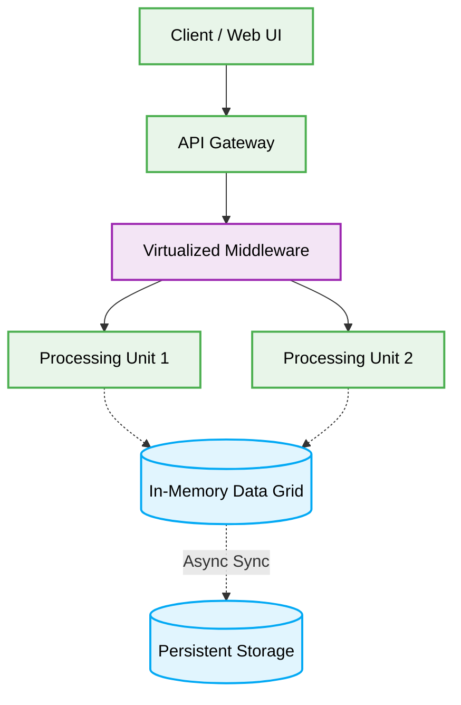

  # 🌌 Space-Based Architecture Production-Ready Best Practices

---

This engineering directive defines the **best practices** for the Space-Based Architecture (SBA). This document is designed to ensure maximum scalability, security, and code quality when developing applications that require extreme high-performance and low-latency under unpredictable, fluctuating user loads.

# Context & Scope
- **Primary Goal:** Provide strict architectural rules and practical patterns for building systems that rely on distributed in-memory data grids to eliminate database bottlenecks.
- **Description:** A pattern designed to minimize the constraints of a central database by keeping state in an in-memory data grid. The architecture relies on "processing units" that independently execute logic and communicate with each other or the grid.

---

## Map of Patterns
- 📊 [**Data Flow:** Request and Event Lifecycle](./data-flow.md)
- 📁 [**Folder Structure:** Layering logic](./folder-structure.md)
- 🛠️ [**Implementation Guide:** Code patterns and Anti-patterns](./implementation-guide.md)
- ⚖️ [**Trade-offs:** Pros, Cons, and System Constraints](./trade-offs.md)

## Architecture Diagram

