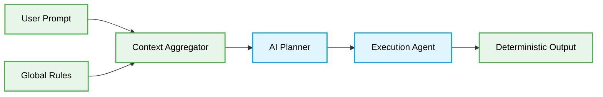

# 🌊 Data Flow: Context Injection and Execution

The data flow in vibe coding dictates how an AI agent ingests context, plans execution, and writes deterministic code.

## Flow Process



## 1. Unbounded Context Injection Flow

### ❌ Bad Practice
```typescript
// Sending raw user input directly to the LLM without global rules
const result = await llm.generateCode(userPrompt);
```

### ⚠️ Problem
Feeding unbounded, unfiltered prompts directly to the execution agent causes hallucinations. The agent lacks global constraints and produces non-deterministic code.

### ✅ Best Practice
```typescript
// Strictly aggregating rules and constraints before execution
const rules = await loadGlobalConstraints();
const context = await buildDeterministicContext(userPrompt, rules);
const plan = await planner.createPlan(context);
const result = await llm.executePlan(plan);
```

### 🚀 Solution
A multi-stage pipeline MUST be enforced. Context is aggressively filtered, combined with strict architectural rules, and processed into an execution plan BEFORE code generation occurs. This ensures O(1) ambiguity and strictly deterministic results.
