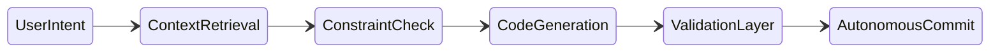

# 🌊 Data Flow (Vibe Coding Patterns)



---

## 1. Asynchronous Context Loading

### ❌ Bad Practice
```typescript
async function flow() {
  const code = await llm.generate("Update user API");
  await applyCode(code); // Missing validation
}
```

### ⚠️ Problem
Directly applying generated code without validation creates race conditions and introduces untested anomalies into the primary branch.

### ✅ Best Practice
```typescript
async function flow() {
  const code = await llm.generate("Update user API with Strict Typed DTOs");
  const isValid = await validateFidelity(code);
  if (isValid) {
     await commitToMain(code);
  } else {
     throw new Error("Fidelity check failed");
  }
}
```

### 🚀 Solution
Injecting a deterministic ValidationLayer (like a Fidelity Check Runner) strictly verifies the payload against AST schemas. If valid, the state transitions automatically to an autonomous commit, enforcing code safety.
