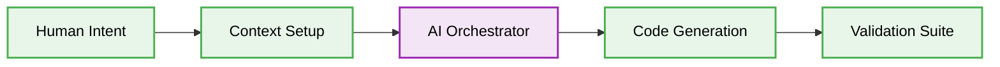

# 🌊 Data Flow in Vibe Coding

## Core Data Flow Pattern

Data flows strictly in a unidirectional manner from human intent to deterministic AI output, validated via CI checks.



### ❌ Bad Practice
```typescript
function complexFlow(data: any) {
  let state = data;
  state = modifyState(state);
  return sendToDB(state);
}
```

### ⚠️ Problem
Mutating state unpredictably breaks the deterministic nature required by AI agents.

### ✅ Best Practice
```typescript
interface DataState {
  readonly value: string;
}

function computeFlow(state: DataState): DataState {
  return { value: state.value + "_processed" };
}
```

### 🚀 Solution
Unidirectional data flow and immutable state guarantee that AI generation does not introduce unintended side-effects into the system.