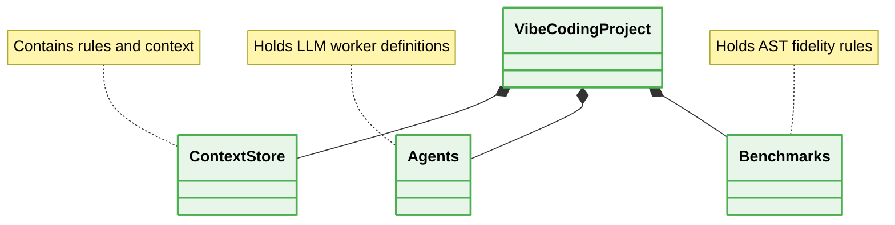

# 📁 Folder Structure (Vibe Coding Patterns)



---

## 1. Scattered Configuration Files

### ❌ Bad Practice
```text
project/
  agent.js
  schema.json
  main.ts
```

### ⚠️ Problem
Agent configurations, schemas, and source code are intertwined. Multi-agent systems cannot reliably locate the structural constraints, resulting in unpredictable runtime behavior.

### ✅ Best Practice
```text
project/
  context/
  agents/
  benchmarks/
  src/
```

### 🚀 Solution
Strictly isolate `context`, `agents`, and `benchmarks` into dedicated modules. This composition provides O(1) directory lookup for Orchestrator Agents, preventing schema-to-code collisions.
