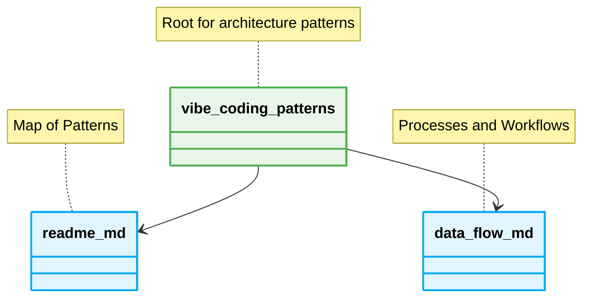

# 📁 Folder Structure for Vibe Coding

## Standard Directory Layout



### ❌ Bad Practice
```text
project/
├── data/
├── scripts/
└── temp.txt
```

### ⚠️ Problem
Lack of structure causes the AI to search globally, consuming vast token context.

### ✅ Best Practice
```text
src/
├── 📁 core/
│   └── 📁 domain/
└── 📁 orchestrator/
```

### 🚀 Solution
Strict isolation keeps the AI agent's context focused, significantly reducing hallucinations.