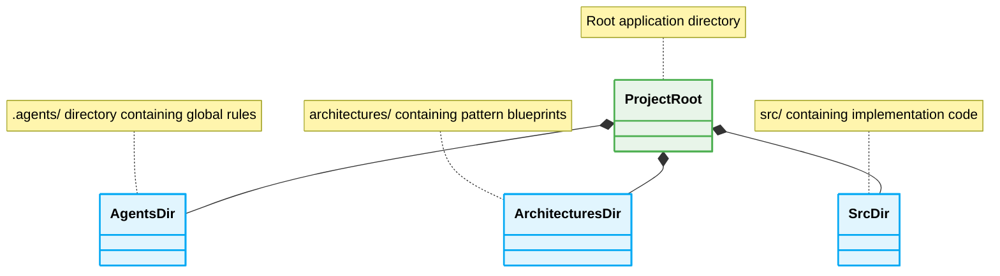

# 📁 Folder Structure: Context Isolation

A predictable folder structure is MANDATORY for AI agents to locate and ingest context deterministically without scanning unrelated files.

## Structure Model



## 1. Monolithic Rule Management

### ❌ Bad Practice
```text
/src
  index.ts
  rules.txt
  logic.ts
```

### ⚠️ Problem
Mixing rules and logic in the same directory leads to context pollution. AI agents struggle to distinguish between instructional meta-data and actual application code.

### ✅ Best Practice
```text
/.agents
  global-rules.md
/architectures
  readme.md
/src
  index.ts
```

### 🚀 Solution
Strictly isolate meta-instructions into dedicated directories (e.g., `.agents/` and `architectures/`). This allows AI agents to predictably load constraints before analyzing the `src/` directory, achieving high-fidelity generation.
