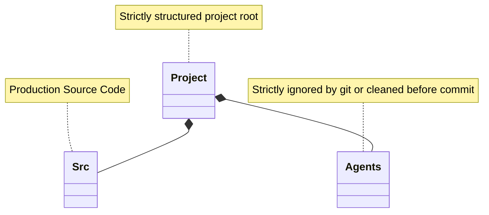

# 📁 Folder Structure for Vibe Projects

Isolating AI generation artifacts from production code.

## Structuring the Workspace

### ❌ Bad Practice
```text
/project
  app.js
  scratch.js
  agent-test-1.txt
  temp-generation.md
```

### ⚠️ Problem
Mixing temporary scratchpads with production files contaminates the source tree, confuses IDE-based AI indexing, and accidentally ships exploration code to production.

### ✅ Best Practice
```text
/project
  /src
    app.ts
  /.agents
    scratchpad.md
    validation-scripts/
```

### 🚀 Solution
Strictly isolate AI-generated temporary artifacts in dot-folders (e.g., `/.agents/`). Use these exclusively for vibe-check testing and data gathering. Before committing, an automated script MUST verify no scratch files leaked into `/src/` or exist tracked in version control.


