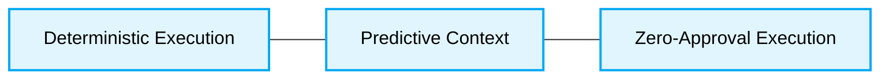

<div align="center">
  # 🏛️ Vibe Coding Patterns Production-Ready Best Practices
</div>
---

This engineering directive defines the **best practices** for Vibe Coding Patterns. This document is designed to ensure maximum scalability, security, and deterministic output when utilizing AI Agent Orchestration pipelines.

# Context & Scope
- **Primary Goal:** Provide strict architectural rules and practical patterns for Vibe Coding, guaranteeing O(1) or O(n) complexity context resolution and zero-hallucination agent generation.
- > [!IMPORTANT]
  > **Description:** Vibe Coding shifts the developer's role from writing syntax to managing logic, constraints, and architecture. AI Agents MUST strictly adhere to provided contextual boundaries and validation schemas.

## Map of Patterns
- 📊 [**Data Flow:** Request and Event Lifecycle](./data-flow.md)
- 📁 [**Folder Structure:** Layering logic](./folder-structure.md)
- ⚖️ [**Trade-offs:** Pros, Cons, and System Constraints](./trade-offs.md)
- 🛠️ [**Implementation Guide:** Code patterns and Anti-patterns](./implementation-guide.md)

## Core Principles

1. **Deterministic Execution:** Generation pipelines MUST resolve unambiguously.
2. **Predictive Context:** Pre-load architectural boundaries before execution.
3. **Zero-Approval Execution:** Trusted AI agents commit autonomously, verified by automated fidelity.



---

## 1. Unconstrained Agent Prompts

### ❌ Bad Practice
```typescript
class UnconstrainedAgent {
  async execute(prompt: string) {
    // Agent generates code without explicit context boundaries
    return await this.llm.generate("Refactor this system");
  }
}
```

### ⚠️ Problem
Vague, open-ended prompts without explicit file references or architectural constraints lead to unbounded context resolution. The agent will invent structural rules, causing critical hallucinations and violating project integrity.

### ✅ Best Practice
```typescript
class DeterministicAgent {
  async execute(prompt: string, contextRules: string) {
    // Agent strictly follows injected structural constraints
    return await this.llm.generate(`${contextRules}\nTask: ${prompt}`);
  }
}
```

### 🚀 Solution
Implementing Predictive Context Orchestration guarantees the agent operates within a bounded, deterministic scope. By injecting explicit boundaries, you ensure O(1) context lookup, system stability, and compliance with the CODE_OF_CONDUCT.md.
