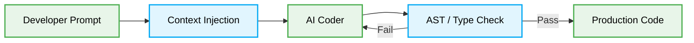

# 🌀 Vibe Coding Patterns

[🏠 На главную](../../README.md) | [⬅️ Back to Architectures](../readme.md)

# Context & Scope
- **Primary Goal:** Establish definitive rules for Vibe Coding to ensure deterministic AI code generation and reliable orchestration.
- **Target Tooling:** Cursor, Copilot, AI Developer Agents.
- **Tech Stack Version:** Agnostic

  

  **Deterministic coding through vibe alignment and strict constraints.**

---
## 🗺️ Map of Patterns (Vibe Modules)

This architecture defines how humans and agents interface via strictly structured context to ensure high-fidelity codebase evolution without hallucination.

- [🌊 Data Flow](./data-flow.md): Tracing prompt instructions to final AST execution.
- [📁 Folder Structure](./folder-structure.md): Organizing scratchpads, scripts, and production code.
- [⚖️ Trade-offs](./trade-offs.md): Balancing context window limits vs. generation fidelity.
- [🛠️ Implementation Guide](./implementation-guide.md): The deterministic step-by-step execution protocol.

