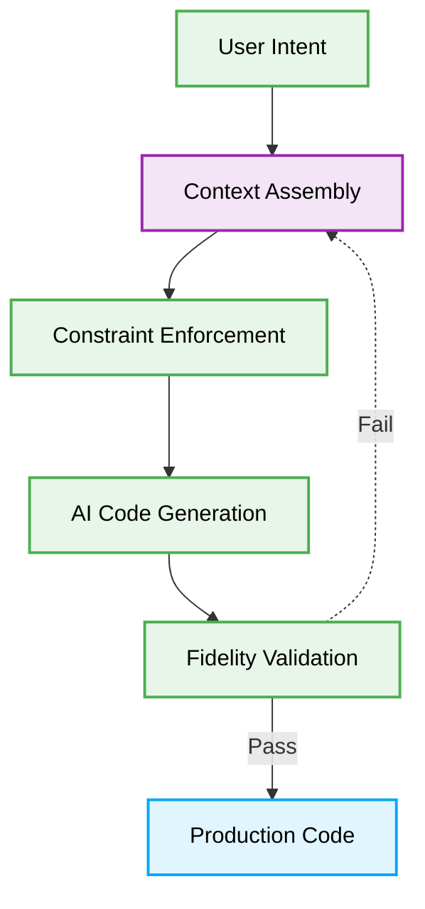

# 🤖 Vibe Coding Patterns: Production-Ready Best Practices

# Context & Scope
- **Primary Goal:** Document and execute the best practices for Vibe Coding and AI Agent Orchestration to ensure deterministic, scalable code generation.
- **Target Tooling:** AI Agents and Human Orchestrators.
- **Tech Stack Version:** Agnostic

<div align="center">
  

  **Deterministic blueprints for scalable Vibe Coding.**
</div>

---
## 🗺️ Map of Patterns (Vibe Modules)

This architecture defines the operational boundaries for Vibe Coding workflows, specifically optimizing for clear context, architectural constraints, and deterministic outputs.

- 🌊 **Data Flow:** From User Intent to Deterministic Code Execution.
- 📁 **Folder Structure:** Modular isolation of Prompts, Scripts, and Validations.
- ⚖️ **Trade-offs:** Speed vs. Hallucination Risk.
- 🛠️ **Implementation Guide:** Rules for defining strict agent personas and context constraints.



## 🚀 The Core Philosophy

Vibe Coding Patterns emphasize the shift from manual syntax authoring to strict architectural constraint management. By establishing robust meta-instructions and limiting context windows, you direct AI Agents to implement features flawlessly on the first attempt.

> [!IMPORTANT]
> **AI Constraint:** Agents MUST NOT infer architectural patterns. They MUST receive explicit, bounded context and strict formatting instructions to guarantee deterministic outputs.

---

## 1. Unbounded Context Injection

### ❌ Bad Practice
```typescript
class VibeAgent {
  constructor(private readonly llm: LLMClient) {}

  async generateFeature(userPrompt: string) {
    // Agent gathers the entire repository codebase as context
    const fullRepoContext = await this.readAllFiles();
    const prompt = `You are a senior engineer. Implement the feature described here: ${userPrompt}.
                    Here is the entire codebase context: ${fullRepoContext}`;

    const response = await this.llm.generate(prompt);
    return response;
  }
}
```

### ⚠️ Problem
Providing an unbounded context window to an AI Agent leads to "Contextual Hallucination." The agent is overwhelmed by irrelevant details, resulting in non-deterministic code that may introduce legacy patterns, break existing abstractions, or fail to adhere to specific local constraints. This drastically increases token costs and latency while degrading code fidelity.

### ✅ Best Practice
```typescript
interface ContextPayload {
    targetFiles: string[];
    interfaces: string[];
    constraints: string[];
}

class DeterministicVibeAgent {
  constructor(private readonly llm: LLMClient) {}

  async generateFeature(userPrompt: string, payload: ContextPayload) {
    // 1. Agent receives strictly bounded, relevant context
    const scopedContext = await this.readSpecificFiles(payload.targetFiles);

    // 2. Strict constraints are applied to the generation prompt
    const prompt = `You are an AI specialized in executing instructions exactly.
                    Task: ${userPrompt}
                    Context: ${scopedContext}
                    Interfaces to adhere to: ${payload.interfaces.join(', ')}
                    Constraints: ${payload.constraints.join(', ')}

                    Return ONLY valid code.`;

    const response = await this.llm.generate(prompt);
    return response;
  }
}
```

### 🚀 Solution
Implementing **Bounded Context Injection** strictly limits the information the AI Agent processes. By providing only the exact files, interfaces, and constraints relevant to the specific task (O(1) relevant context per generation), you significantly lower token overhead, eliminate noise, and enforce deterministic, high-fidelity code generation that aligns perfectly with the intended architecture.
